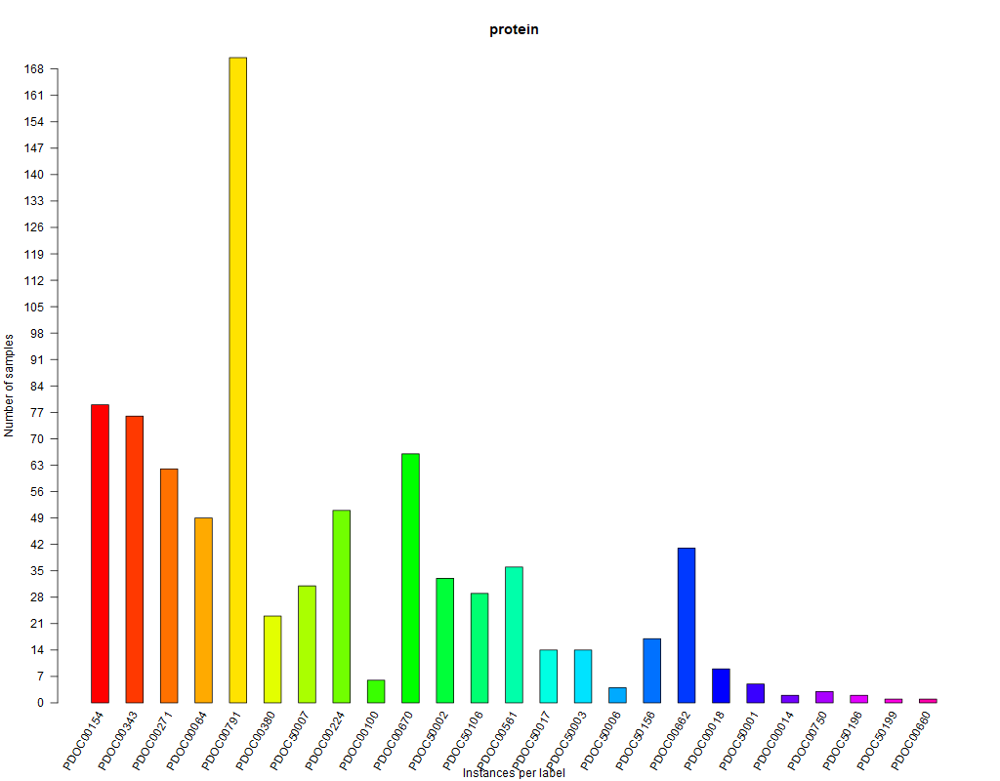

```{r}
# "utiml" and "mldr" packages for multi-label classification in R
# https://journal.r-project.org/archive/2018/RJ-2018-041/RJ-2018-041.pdf
# https://github.com/rivolli/utiml
# https://cran.r-project.org/web/packages/mldr/vignettes/mldr.pdf
# https://github.com/fcharte/mldr
library(utiml)
library(mldr)
# following package offers benchmarks for multi-label classification
library(mldr.datasets)
set.seed(123)
```

# ng20 Dataset

```{r}
summary(ng20)
# ng20, a corpus with 19300 documents, 1006 words and 20 multi-labels
# Ken Lang, "Newsweeder: Learning to filter netnews", 12th ICML Conference
ng20$labels
# not practical, but part of its corpus can be viewed doing
ng20corpus <- ng20$dataset
# ng20's bag of words
dim(ng20corpus)
# colnames(ng20corpus)
# consult the help of the following function
ng20 <- remove_skewness_labels(ng20, 10)
# label bat plot
plot(ng20, type = "LB")
# visual relations among labels
plot(ng20, type = "LC")
# create a holdout partition: train and predict to evaluate
# I created a small test partition as the prediction step takes a long time
ds <- create_holdout_partition(ng20, c(train = 0.90, test = 0.10))
```

```{r}
# an external GUI interface to explore the "ng20" dataset
# mldrGUI() # press "escape" to exit GUI
```


## Binary Relevance Naive Bayes

```{r}
# Binary relevance ML strategy with naive Bayes base classifier
model_BR_NB <- utiml::br(ds$train, "NB")
predictionsBR <- predict(model_BR_NB, ds$test)
resultsBRPerExamples <- multilabel_evaluate(
    ds$test, predictionsBR,
    c("example-based")
)
resultsBRPerExamples
resultsBRPerLabel <- multilabel_evaluate(
    ds$test, predictionsBR,
    c("label-based")
)
resultsBRPerLabel
```

## Classifier Chain Naive Bayes

```{r}
# Classifier Chain ML strategy with naive Bayes base classifier
# Define the chain-order between labels: sample a random order
mychain <- sample(rownames(ng20$labels))
model_CC_NB <- cc(ds$train, "NB", mychain)
predictionsCC <- predict(model_CC_NB, ds$test)
resultsCCPerExamples <- multilabel_evaluate(
    ds$test, predictionsCC,
    c("example-based")
)
resultsCCPerExamples
resultsCCPerLabel <- multilabel_evaluate(
    ds$test, predictionsCC,
    c("label-based")
)
resultsCCPerLabel
```

# birds Dataset

```{r}
# "birds" dataset to predict the set of birds species
# that are present, given a ten-second audio clip:
# https://doi.org/10.1109/MLSP.2013.6661934
summary(birds)
birds$labels
birds <- remove_skewness_labels(birds, 10)
# Type "birds$" for its list of attributes
plot(birds, type = "LB")
# visual relations among labels
plot(birds, type = "LC")
# create a holdout partition: train and predict to evaluate
ds <- create_holdout_partition(birds, c(train = 0.66, test = 0.34))
```

```{r}
# an external GUI interface to explore the "birds" dataset
# mldrGUI() # press "escape" to exit GUI
```


## Binary Relevance Naive Bayes

```{r}
# Binary relevance ML strategy with naive Bayes base classifier
model_BR_NB <- utiml::br(ds$train, "NB")
predictionsBR <- predict(model_BR_NB, ds$test)
resultsBRPerExamples <- multilabel_evaluate(
    ds$test, predictionsBR,
    c("example-based")
)
resultsBRPerExamples
resultsBRPerLabel <- multilabel_evaluate(
    ds$test, predictionsBR,
    c("label-based")
)
resultsBRPerLabel
```

## Classifier Chain Naive Bayes

```{r}	
# Classifier Chain ML strategy with naive Bayes base classifier
# Define the chain-order between labels: sample a random order
mychain <- sample(rownames(birds$labels))
model_CC_NB <- cc(ds$train, "NB", mychain)
predictionsCC <- predict(model_CC_NB, ds$test)
resultsCCPerExamples <- multilabel_evaluate(
    ds$test, predictionsCC,
    c("example-based")
)
resultsCCPerExamples
resultsCCPerLabel <- multilabel_evaluate(
    ds$test, predictionsCC,
    c("label-based")
)
resultsCCPerLabel
```

# enron Dataset

```{r}
# PROPOSED EXERCISE
# Complete a similar work, for the popular Enron-Corpus of e-mails
# To create the corpus and the associated dataFrame
# A description of its labels appears in the following lists:
# https://bailando.berkeley.edu/enron/enron_categories.txt
# https://data.world/brianray/enron-email-dataset
# where for example "label 2.13" in the lists  is "label B.B13" for enron-labels
enron = enron()
summary(enron)
enron$labels
enron <- remove_skewness_labels(enron, 10)
# Type "enron$" for its list of attributes
plot(enron, type = "LB")
# visual relations among labels
plot(enron, type = "LC")
# create a holdout partition: train and predict to evaluate
ds <- create_holdout_partition(enron, c(train = 0.66, test = 0.34))
```

```{r}
# an external GUI interface to explore the "enron" dataset
# mldrGUI() # press "escape" to exit GUI
```


## Binary Relevance Naive Bayes

```{r}
# Binary relevance ML strategy with naive Bayes base classifier
model_BR_NB <- utiml::br(ds$train, "NB")
predictionsBR <- predict(model_BR_NB, ds$test)
resultsBRPerExamples <- multilabel_evaluate(
    ds$test, predictionsBR,
    c("example-based")
)
resultsBRPerExamples
resultsBRPerLabel <- multilabel_evaluate(
    ds$test, predictionsBR,
    c("label-based")
)
resultsBRPerLabel
```

## Classifier Chain Naive Bayes

```{r}	
# Classifier Chain ML strategy with naive Bayes base classifier
# Define the chain-order between labels: sample a random order
mychain <- sample(rownames(enron$labels))
model_CC_NB <- cc(ds$train, "NB", mychain)
predictionsCC <- predict(model_CC_NB, ds$test)
resultsCCPerExamples <- multilabel_evaluate(
    ds$test, predictionsCC,
    c("example-based")
)
resultsCCPerExamples
resultsCCPerLabel <- multilabel_evaluate(
    ds$test, predictionsCC,
    c("label-based")
)
resultsCCPerLabel
```

# emotions Dataset

```{r}
# "emotions" dataset to predict the set of emotions species
# that are present, given a ten-second audio clip:
# https://doi.org/10.1109/MLSP.2013.6661934
summary(emotions)
emotions$labels
emotions <- remove_skewness_labels(emotions, 10)
# Type "emotions$" for its list of attributes
plot(emotions, type = "LB")
# visual relations among labels
plot(emotions, type = "LC")
# create a holdout partition: train and predict to evaluate
ds <- create_holdout_partition(emotions, c(train = 0.66, test = 0.34))
```

```{r}
# an external GUI interface to explore the "emotions" dataset
# mldrGUI() # press "escape" to exit GUI
```


## Binary Relevance Naive Bayes

```{r}
# Binary relevance ML strategy with naive Bayes base classifier
model_BR_NB <- utiml::br(ds$train, "NB")
predictionsBR <- predict(model_BR_NB, ds$test)
resultsBRPerExamples <- multilabel_evaluate(
    ds$test, predictionsBR,
    c("example-based")
)
resultsBRPerExamples
resultsBRPerLabel <- multilabel_evaluate(
    ds$test, predictionsBR,
    c("label-based")
)
resultsBRPerLabel
```

## Classifier Chain Naive Bayes

```{r}	
# Classifier Chain ML strategy with naive Bayes base classifier
# Define the chain-order between labels: sample a random order
mychain <- sample(rownames(emotions$labels))
model_CC_NB <- cc(ds$train, "NB", mychain)
predictionsCC <- predict(model_CC_NB, ds$test)
resultsCCPerExamples <- multilabel_evaluate(
    ds$test, predictionsCC,
    c("example-based")
)
resultsCCPerExamples
resultsCCPerLabel <- multilabel_evaluate(
    ds$test, predictionsCC,
    c("label-based")
)
resultsCCPerLabel
```

# genbase Dataset

```{r}
# "genbase" dataset to predict the set of genbase species
# that are present, given a ten-second audio clip:
# https://doi.org/10.1109/MLSP.2013.6661934
summary(genbase)
genbase$labels
genbase <- remove_skewness_labels(genbase, 10)
# Type "genbase$" for its list of attributes
plot(genbase, type = "LB")
# visual relations among labels
plot(genbase, type = "LC")
# create a holdout partition: train and predict to evaluate
ds <- create_holdout_partition(genbase, c(train = 0.66, test = 0.34))
```

```{r}
# an external GUI interface to explore the "genbase" dataset
# mldrGUI() # press "escape" to exit GUI
```




## Binary Relevance Naive Bayes

```{r}
# Binary relevance ML strategy with naive Bayes base classifier
model_BR_NB <- utiml::br(ds$train, "NB")
predictionsBR <- predict(model_BR_NB, ds$test)
resultsBRPerExamples <- multilabel_evaluate(
    ds$test, predictionsBR,
    c("example-based")
)
resultsBRPerExamples
resultsBRPerLabel <- multilabel_evaluate(
    ds$test, predictionsBR,
    c("label-based")
)
resultsBRPerLabel
```

## Classifier Chain Naive Bayes

```{r}	
# Classifier Chain ML strategy with naive Bayes base classifier
# Define the chain-order between labels: sample a random order
mychain <- sample(rownames(genbase$labels))
model_CC_NB <- cc(ds$train, "NB", mychain)
predictionsCC <- predict(model_CC_NB, ds$test)
resultsCCPerExamples <- multilabel_evaluate(
    ds$test, predictionsCC,
    c("example-based")
)
resultsCCPerExamples
resultsCCPerLabel <- multilabel_evaluate(
    ds$test, predictionsCC,
    c("label-based")
)
resultsCCPerLabel
```