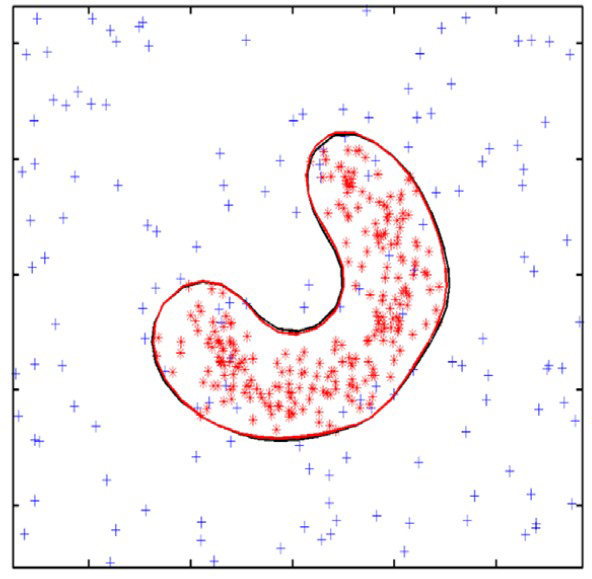
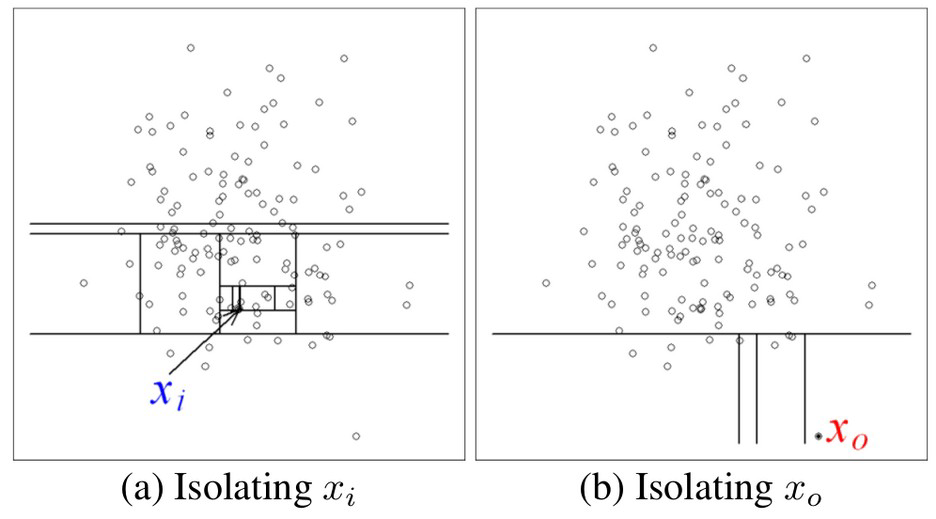
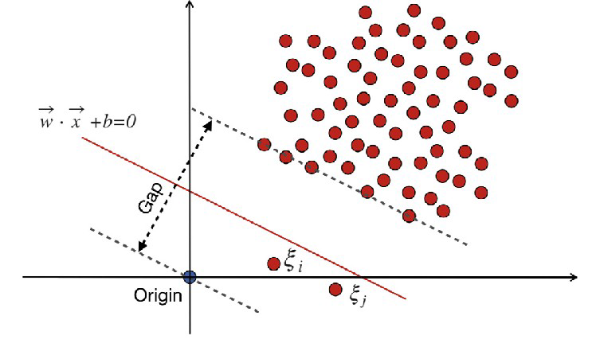
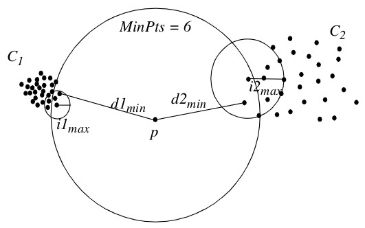
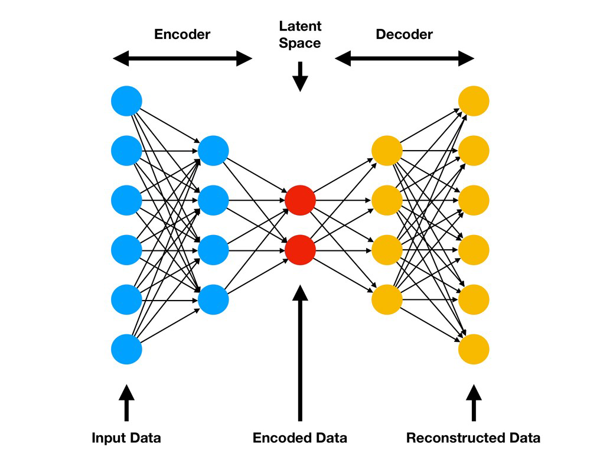

* Outlier samples → sparse, minoritary,
category
* Outlier scenario → multi-class scenario +
more than one class
* One-class classifification → single class
* Single class → model its boundary + isolate
the “rest”
* Non-single-class samples → non-modeled



# Spambase Dataset

* Choose a supervised dataset (e.g. spambase)
* Choose one of its classes (e.g. “non-spam e-mails”)
* Apply the one-class method over it
* Be careful, methods may only work with numerical features. Remove the class!
* Graph “outlierness” distribution → cut-off point to decide
outliers
* Are there suspicious outliers within this class e-mails?

```{r}
spambase = read.csv(file="../data/spambase.csv", header=TRUE, sep=",")
spambase$class = as.factor(spambase$class)
spambaseNONSPAM = spambase[spambase$class == 0,]
spambaseNONSPAM = spambaseNONSPAM[,-58]
print(spambaseNONSPAM)
```
# Isolation Forest

* Compute “isolation score” per sample
* Construct a tree per sample
* Random splits on attribute values
* → isolates the sample from the rest
* → “outliers easy to isolate...”
* Path length from root to node
* ~ “isolation score” = “outlierness”
* “low path length” ~ “high outlierness”
* → easy to isolate point
* → graph “outlierness” values → threshold



```{r}
# Package with IsolationForest implementation
library(solitude)

# Empty tree structure
iso <- isolationForest$new()

# Learn the IsolationForest for our data
iso$fit(spambaseNONSPAM)
p <- iso$predict(spambaseNONSPAM)
#print(p)
sort(p$anomaly_score)
plot(density(p$anomaly_score))

# Base don the plot, decide the cut-off point (e.g > 0.63)
which(p$anomaly_score > 0.63)
```

# OneClass SVM (OCSVM)

* Learn a SVM with single-class samples
* Map to higher dimension space
* Separating hyperplane
* Maximize margin between origin and data
* Outliers → points outside boundary


```{r}
library(e1071)

df <- spambaseNONSPAM

# train a SVM one-classification model
model <-svm(df, y=NULL, type='one-classification')
summary(model)

# CAUTION: testing on the same training set
# TRUE values mean suspect outliers
pred <- predict(model, df)
which(pred == TRUE)
table(pred)

```

# Local Outlier Factor (LOF)

* Distance-based algorithm
* To decide “outlier”
* → by local neighborhood
* → by local density
* Parameter → k, number of neighbours
* Calculate the neighborhood
* Outlier → defifined “locally”
* Outlierness → compute density of its local k-neighborhood



```{r}
library(DDoutlier)

# calculate "outlierness" score, by LOF
outlierness = LOF(dataset=spambaseNONSPAM, k=5)

# assign an index to outlierness values
names(outlierness) <- 1:nrow(spambaseNONSPAM)
sort(outlierness, decreasing=TRUE)
hist(outlierness)
which(outlierness > 2.0)
```

# Autoencoder

* Learn representation of data
* Reducing to non-linear dimensions in
hidden layers
* {Encode + Decode} 1-class data
* Check for anomalies
* Does the autoencoder “reconstruct” the
input data in the output?
* → “reconstruction error”
* → high value indicative of outlierness
* Hidden layers' features
* Compact, non-linear representation
* → learn with them a supervised model?



```{r}
library(h2o)
h2.init()
protate_path = sytem.file("extdata", "../data/spambase.csv", package="h2o")
prostate = h2o.importFile(path = prostate_path)
colnames(prostate)
dim(prostate)

# learn autoencoder with 2 hidden layers of 10 units each
autoencoder_model = h2o.deeplearning(x=3:9,
                                     training_frame=prostate, 
                                     autoencoder=TRUE,
                                     hidden=c(10,10),
                                     epochs=5)

# features in the autoencoder's first hidden layer
deep_features_layer1 = h2o.deepfeatures(autoencoder_model, prostate, layer=1)

# further supervised models can be trained with these features
head(deep_features_layer1)

# reconstruction error per sample ~ outlierness indicative
reconstruction_error = h2o.anomaly(autoencoder_model, prostate)
head(reconstruction_error)
reconstruction_error = as.data.frame(reconstruction_error)
plot(sort(reconstruction_error$Reconstruction.MSE), main="Reconstruction Error")
which(reconstruction_error > 0.15)
```

