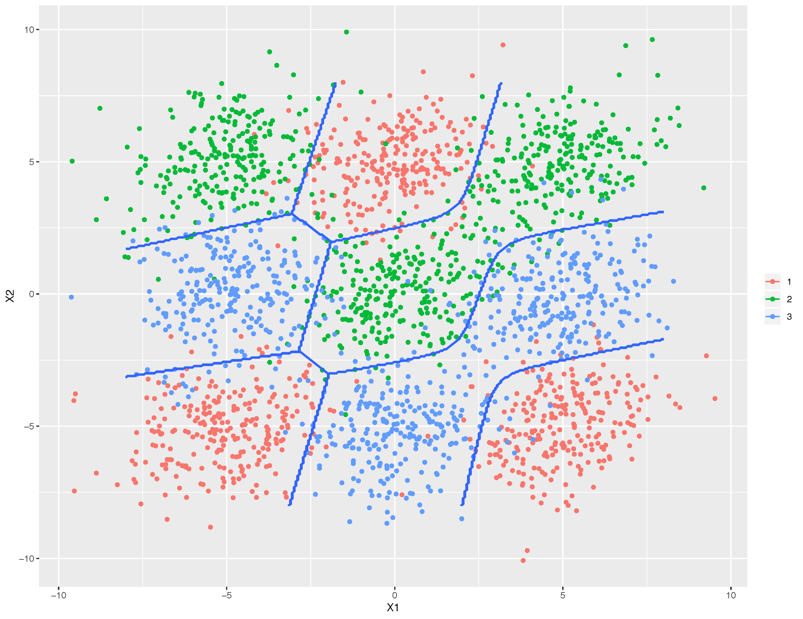
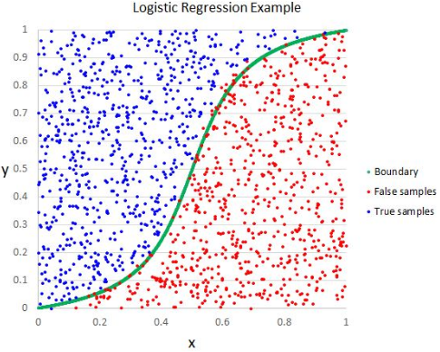

# Corpus

Twitter provides us with vast amounts of user-generated language data, which is a dream for anyone wanting to conduct textual analysis. The `twitteR` library provides access to Twitter data. Twitter marks its use as the ‘official’ way to download its tweets. An attractive and ‘easy-to-use’ alternative to Twitter’s ‘official rules’ is based on the use of the `rtweet` package. The [following link](https://github.com/ropensci/rtweet) seems to be a more updated package. This [set of slides](https://mkearney.github.io/nicar_tworkshop/) offers an easy-to-follow tutorial, showing the pipeline that you need.

Twitter’s link to create Twitter applications is https://developer.twitter.com/en/apps. You need to be logged in to Twitter to create a new app. This will provide you a set of 5 items related to the application called `app`, `consumerKey`, `consumerSecret`, `accessToken` and `accessSecret`. Both `accessToken` and `accessSecret` need to be activated after receiving the `consumerKey` and `consumerSecret`. Five parameters need to be used in the final authentification function call, `create_token()`.

```
token <- create_token(
    app = app,
    consumer_key = consumer_key,
    consumer_secret = consumer_secret,
    access_token = access_key,
    access_secret = access_secret
)
```

Once the authentification is done, tweets of any user or hashtag can be retrieved and converted to a corpus. In this case, I have decided to make a corpus with the tweets of two mobile game accounts. As they are similar games, performing classification of tweets will be a challenging task. Only the last 1000 tweets of each account are retrieved.

Therefore, we have a binary classification problem, where the class is `clashroyale` or `clashofclans`. As we are working with text, the predictive features that we have are related to words.

```{r}
library(rtweet)
# retrieve user tweets
n <- 1000
clashroyale_tweets <- get_timeline("clashroyale", n = n)
clashofclans_tweets <- get_timeline("clashofclans", n = n)
```

In the first 5 tweets of each dataset we can see that the tweets don't only have words. There are also links and emotes for example. In the next section we will have to decide what we want to do with those words. Apart from the text, many other data is return by the previous function. In total, there are 90 columns, but we will only use a few of them. The most important one is the `text` column. We will use some other features such as the date for visualization.

```{r}
head(clashroyale_tweets, n = 5L)
head(clashofclans_tweets, n = 5L)
clashroyale_tweets$text[1:5]
clashofclans_tweets$text[1:5]
```

We can use the `tm` library to build a corpus for each class. Each tweet will be a document in this corpus. Then we can merge them to have a single corpus. Building a corpus is recommended because the `tm` package offers many transformations for preprocessing text.

```{r}
library(tm)
# combine both frames in a single, binary, annotated set
tweets <- rbind(clashroyale_tweets, clashofclans_tweets)
# interpreting each element of the annotated vector as a document
clashroyale_docs <- VectorSource(clashroyale_tweets$text)
clashofclans_docs <- VectorSource(clashofclans_tweets$text)
# convert to a corpus: supervised classification to be applied in future steps
clashroyale_corpus <- VCorpus(clashroyale_docs)
clashofclans_corpus <- VCorpus(clashofclans_docs)
# merge, concatenate both groups-corpuses
corpus <- c(clashroyale_corpus, clashofclans_corpus)
```

# Visualization

Visualizing the data is important to understand our corpus. In this section there are various time series plots, donut plots and wordclouds.

## Time Series Plot

We can use the `rtweet` package get a time series plot with the frequencies of tweets. In these examples, I analyse the frequencies of both accounts by month, week and day. The tweet frequencies are similar, Clash Royale has more tweets.

```{r}
ts_plot(dplyr::group_by(tweets, screen_name), "month") +
    ggplot2::theme_minimal() +
    ggplot2::theme(plot.title = ggplot2::element_text(face = "bold")) +
    ggplot2::labs(
        x = "Date", y = "Count",
        title = "Frequency of Tweets from Clash Royale and Clash of Clans",
        subtitle = "Tweet counts aggregated by month"
    )
```

```{r}
ts_plot(dplyr::group_by(tweets, screen_name), "week") +
    ggplot2::theme_minimal() +
    ggplot2::theme(plot.title = ggplot2::element_text(face = "bold")) +
    ggplot2::labs(
        x = "Date", y = "Count",
        title = "Frequency of Tweets from Clash Royale and Clash of Clans",
        subtitle = "Tweet counts aggregated by week"
    )
```

```{r}
ts_plot(dplyr::group_by(tweets, screen_name), "day") +
    ggplot2::theme_minimal() +
    ggplot2::theme(plot.title = ggplot2::element_text(face = "bold")) +
    ggplot2::labs(
        x = "Date", y = "Count",
        title = "Frequency of Tweets from Clash Royale and Clash of Clans",
        subtitle = "Tweet counts aggregated by day"
    )
```

## Tweet Types Chart

Analysing the ratio of quotes, replies, retweets and organic tweets can tell us the type of tweets we are analysing. We could choose to only keep organic tweets for our corpus. Removing retweets might reduce the variability of the data and therefore, make it easier to classify. This time we will keep all tweet types, but we will still visualize the types in a donut chart.

As a first step we have to divide each account tweets into the previously mentioned subsets.

```{r}
tweet_types <- function(tweets) {
    organic <- tweets[tweets$is_retweet == FALSE, ]
    # Remove replies
    organic <- subset(organic, is.na(organic$reply_to_status_id))
    # Remove quotes
    organic <- organic[organic$is_quote == FALSE, ]
    # Keeping only the retweets
    retweets <- tweets[tweets$is_retweet == TRUE, ]
    # Keeping only the replies
    replies <- subset(tweets, !is.na(tweets$reply_to_status_id))
    # Keeping only the quotes
    quotes <- tweets[tweets$is_quote == TRUE, ]
    types_list <- list(organic, retweets, replies, quotes)
    return(types_list)
}
```

```{r}
# get clashroyale tweet types
clashroyale_types <- tweet_types(clashroyale_tweets)
clashroyale_organic <- clashroyale_types[[1]]
clashroyale_retweets <- clashroyale_types[[2]]
clashroyale_replies <- clashroyale_types[[3]]
clashroyale_quotes <- clashroyale_types[[4]]

# get clashofclans tweet types
clashofclans_types <- tweet_types(clashofclans_tweets)
clashofclans_organic <- clashofclans_types[[1]]
clashofclans_retweets <- clashofclans_types[[2]]
clashofclans_replies <- clashofclans_types[[3]]
clashofclans_quotes <- clashofclans_types[[4]]
```

Then, we create a separate data frame containing the number of organic tweets, retweets, replies and quotes. We have to prepare the data frame for a donut chart. This includes adding columns that calculate the ratios and percentages and some visualisation tweaks such as specifying the legend and rounding up your data.

```{r}
type_data <- function(organic, retweets, replies, quotes) {
    # Creating a data frame
    data <- data.frame(
        category = c("Organic", "Retweets", "Replies", "Quotes"),
        count = c(dim(organic)[1], dim(retweets)[1], dim(replies)[1], dim(quotes)[1])
    )

    # Adding columns
    data$fraction <- data$count / sum(data$count)
    data$percentage <- data$count / sum(data$count) * 100
    data$ymax <- cumsum(data$fraction)
    data$ymin <- c(0, head(data$ymax, n = -1))

    # Rounding the data to two decimal points
    data[, -1] <- round(data[, -1], 2)
    return(data)
}
```

```{r}
library(ggplot2)
clashroyale_data <- type_data(clashroyale_organic, clashroyale_retweets, clashroyale_replies, clashroyale_quotes)
type <- paste(clashroyale_data$category, clashroyale_data$percentage, "%")
ggplot(clashroyale_data, aes(ymax = ymax, ymin = ymin, xmax = 4, xmin = 3, fill = type)) +
    geom_rect() +
    coord_polar(theta = "y") +
    xlim(c(2, 4)) +
    theme_void() +
    theme(legend.position = "right") +
    labs(title = "Clash Royale Tweet Types")
```

```{r}
clashofclans_data <- type_data(clashofclans_organic, clashofclans_retweets, clashofclans_replies, clashofclans_quotes)
type <- paste(clashofclans_data$category, clashofclans_data$percentage, "%")
ggplot(clashofclans_data, aes(ymax = ymax, ymin = ymin, xmax = 4, xmin = 3, fill = type)) +
    geom_rect() +
    coord_polar(theta = "y") +
    xlim(c(2, 4)) +
    theme_void() +
    theme(legend.position = "right") +
    labs(title = "Clash of Clans Tweet Types")
```

## Initial Wordclouds

Before starting learning the exposed machine learning models, let’s build a wordcloud with the following package [3]. Its `wordcloud()` command needs the list of words and their frequencies as parameters. As the words appear in columns in the document-term matrix, the `colSums` command is used to calculate the word frequencies. In order to complete the needed calculations, note that the term-document matrix needs to be transformed (casted) to a matrix form with the `as.matrix` cast-operator. This initial document-term matrix is very sparse, it contains 2000 documents and 7854 terms.

We can see that the generated wordclouds are not very informative. The reason for this is that the most common words are english stop words. These words are very common, but d't have any meaning. That's why we should remove them from our corpus.

```{r}
corpus_dtm_init <- DocumentTermMatrix(corpus)
corpus_dtm_init
```

```{r}
library(wordcloud)
word_freqs <- sort(colSums(as.matrix(corpus_dtm_init)[1:n, ]), decreasing = TRUE)
wordcloud(words = names(word_freqs), freq = word_freqs, max.words = 100, random.order = FALSE, colors = brewer.pal(8, "Dark2"))
```

```{r}
word_freqs <- sort(colSums(as.matrix(corpus_dtm_init)[(n + 1):(n + n), ]), decreasing = TRUE)
wordcloud(words = names(word_freqs), freq = word_freqs, max.words = 100, random.order = FALSE, colors = brewer.pal(8, "Dark2"))
```

## Better Wordclouds

To make a better wordcloud, we can pass the text directly. A corpus will be generated and stop words will be removed automatically. However, this time emotes are kept, and we can see that some of them are quite common. We can see that the following wordclouds are much more informative. We can already see some differences and similarities between the corpora.

```{r}
wordcloud(clashroyale_tweets$text, max.words = 50, scale = c(3.5, 0.25), random.order = FALSE, colors = brewer.pal(8, "Dark2"))
```

```{r}
wordcloud(clashofclans_tweets$text, max.words = 50, scale = c(3.5, 0.25), random.order = FALSE, colors = brewer.pal(8, "Dark2"))
```

## Hashtag Worldclouds

Finally, we can create another wordcloud that only contains the hashtags. We can see that hashtags are not very common, but they are different between the two corpora. We will have to decide if we want to keep or remove them in the next section.

```{r}
clashroyale_tweets$hashtags <- as.character(clashroyale_tweets$hashtags)
clashroyale_tweets$hashtags <- gsub("c\\(", "", clashroyale_tweets$hashtags)
wordcloud(clashroyale_tweets$hashtags, min.freq = 1, scale = c(3.5, .5), max.words = 50, random.order = FALSE, rot.per = 0.35, colors = brewer.pal(8, "Dark2"))
```

```{r}
clashofclans_tweets$hashtags <- as.character(clashofclans_tweets$hashtags)
clashofclans_tweets$hashtags <- gsub("c\\(", "", clashofclans_tweets$hashtags)
wordcloud(clashofclans_tweets$hashtags, min.freq = 1, scale = c(3.5, .5), max.words = 50, random.order = FALSE, rot.per = 0.35, colors = brewer.pal(8, "Dark2"))
```

# Preprocessing

As we have said before, some preprocessing is needed so that we get better results when classifying the documents. First, we will apply some transformations such as removing stop words to the text. Then, we will remove sparse words and outlier documents from the corpus. Finally, we will display the final wordclouds so that we can compare them with the initial ones.

## Apply Transformations

Transformations operators to the corpus are applied via `tm_map` function, which applies (maps) a function to all elements of the corpus. The transformations will be applied to the whole corpus, that constains documents of both classes. Apart from the transformations that are available in the `tm` package, some custom transformations are also applied with the function `content_transformer`.

First, some elements are removed from the corpus: numbers, punctuation, urls, mentions, hashtags, newlines and emojis. Then, all the words are converted to lowercase. Next, the previously mentioned english stopwords are removed. After, multiple whitespace characters are collapsed to a single one. Finally, all the words are stemmed to reduce the number of words. We can print the first 5 tweets of each corpus to see the difference with the initial ones.

```{r}
remove_urls <- function(text) {
    gsub("http\\S*", "", text)
}
remove_mentions <- function(text) {
    gsub("@\\S*", "", text)
}
remove_hashtags <- function(text) {
    gsub("#\\S*", "", text)
}
remove_newlines <- function(text) {
    gsub("\\\n", " ", text)
}
remove_emojis <- function(text) {
    gsub("[^\x01-\x7F]", "", text)
}
```

```{r}
# remove numbers
corpus_trans <- tm_map(corpus, removeNumbers)
# remove punctuation
corpus_trans <- tm_map(corpus_trans, removePunctuation)
# remove urls
corpus_trans <- tm_map(corpus_trans, content_transformer(remove_urls))
# remove mentions
corpus_trans <- tm_map(corpus_trans, content_transformer(remove_mentions))
# remove hastags
corpus_trans <- tm_map(corpus_trans, content_transformer(remove_hashtags))
# remove newlines
corpus_trans <- tm_map(corpus_trans, content_transformer(remove_newlines))
# remove emojis
corpus_trans <- tm_map(corpus_trans, content_transformer(remove_emojis))
# convert to lowercase
corpus_trans <- tm_map(corpus_trans, content_transformer(tolower))
# remove english stop words
corpus_trans <- tm_map(corpus_trans, removeWords, stopwords("english"))
# strip whitespace
corpus_trans <- tm_map(corpus_trans, stripWhitespace)
# to access Porter's word stemming algorithm
library(SnowballC)
corpus_trans <- tm_map(corpus_trans, stemDocument)
```

```{r}
for (i in 1:5) {
    print(corpus_trans[[i]]$content)
}
for (i in (n + 1):(n + 6)) {
    print(corpus_trans[[i]]$content)
}
```

## Remove Sparse Terms

After corpus set transformation, a common approach in text mining is to **create a document-term matrix** from a corpus. This document-term matrix is the starting point to apply machine-learning modelization techniques such as classification and clustering. Different operations can be applied over this matrix. We can obtain the terms that occur at least 50 times. We can also consult the **terms that associate** with at least by a 0.3 correlation degree with the term "mainten". We can see that the correlated words make sense: "short maintencance break soon", "server upkeep".

```{r}
corpus_dtm <- DocumentTermMatrix(corpus_trans)
corpus_dtm
findFreqTerms(corpus_dtm, 50)
findAssocs(corpus_dtm, term = "mainten", corlimit = 0.3)
```

We have removed nearly 4000 words from the initiaal document-term matrix. However, it has still a huge degree of sparsity: a low amount of non-zero elements. Thus, one of the most important operations is to remove sparse terms, terms occurring in very few documents. The `sparse` parameter in the `removeSparseTerms` function refers to the maximum sparseness allowed: the smaller its proportion, fewer terms will be retained. A trial and error approach will finally return a proper number of terms. This matrix will be the starting point for building further machine learning models.

After trying multiple values, we decide to keep terms with a maximum sparseness of `0.99`. This seems to be very high, but it reduces the numbers of terms drastically. In fact, selecting lower values of sparseness the number of terms is too low.

```{r}
corpus_dtm_95 <- removeSparseTerms(corpus_dtm, sparse = 0.95)
corpus_dtm_95
barplot(as.matrix(corpus_dtm_95),
    xlab = "terms", ylab = "number of occurrences",
    main = "Most frequent terms (sparseness=0.95)"
)
corpus_dtm_97 <- removeSparseTerms(corpus_dtm, sparse = 0.97)
corpus_dtm_97
barplot(as.matrix(corpus_dtm_97),
    xlab = "terms", ylab = "number of occurrences",
    main = "Most frequent terms (sparseness=0.97)"
)
corpus_dtm_99 <- removeSparseTerms(corpus_dtm, sparse = 0.99)
corpus_dtm_99
terms <- dim(corpus_dtm_99)[2]
barplot(as.matrix(corpus_dtm_99),
    xlab = "terms", ylab = "number of occurrences",
    main = "Most frequent terms (sparseness=0.99)"
)
```

## Outlier Detection

Outlier detection can be used to detect and remove outlier documents from the corpus. We test the Isolation Forest method. I decided not to remove any document to simplify the next steps.

Isolation Forest constructs a tree per document. It tries to isolate the sample from the rest. As outliers are easy to isolate, their isolation score is high. We have to plot the outlierness and decide a threshold.


```{r}
library(solitude)
# Empty tree structure
iso <- isolationForest$new()

# convert dtm to dataframe
corpus_df_99 <- as.data.frame(as.matrix(corpus_dtm_99))

# Learn the IsolationForest for our data
iso$fit(corpus_df_99)

# predict for our data
p <- iso$predict(corpus_df_99)

# plot anomaly score
plot(density(p$anomaly_score), main = "Anomaly Score Density")

# Based on the plot, decide the cut-off point
which(p$anomaly_score > 0.62)
```

## Final Worldclouds

Finally, the wordclouds of the reduced document-term matrix are plotted. We can see the difference with the initial wordcloud. The terms of each wordcloud are significantly different

```{r}
# calculate the frequency of words and sort in descending order.
word_freqs <- sort(colSums(as.matrix(corpus_dtm_99)[1:n, ]), decreasing = TRUE)
wordcloud(words = names(word_freqs), freq = word_freqs, max.words = 50, scale = c(3.5, 0.25), random.order = FALSE, colors = brewer.pal(8, "Dark2"))
```

```{r}
word_freqs <- sort(colSums(as.matrix(corpus_dtm_99)[(n + 1):(n + n), ]), decreasing = TRUE)
wordcloud(words = names(word_freqs), freq = word_freqs, max.words = 50, scale = c(3.5, 0.25), random.order = FALSE, colors = brewer.pal(8, "Dark2"))
```

# Clustering

## Clustering Words

We try to find clusters of words with hierarchical clustering, a popular clustering techniques which builds a dendogram to iteratively group pairs of similar objects. To do so, a matrix with the sparse terms removed is needed. We select the 0.97 sparsity matrix so that we can visualize them. After the application of the matrix-casting operator, number of occurrences are scaled.

We need to calculate the distance between pairs of terms. The `dist` operator performs this calculation between pairs of rows of the provided matrix. As terms appear in the columns of the document-term matrix (`corpus_dtm_97`), it needs to be transposed by means of the `t` operator. The clustering-dendogram is built with the `hclust` operator. It needs as input the calculated distance matrix between pairs of terms and a criteria to decide which pair of clusters to be consecutively joined in the bottom-up dendogram. In this case, the “complete” criteria takes into account the maximum distance between any pair of terms of both clusters to be merged. Heigth in the dendogram denotes the *distance* between a merged pair of clusters.

```{r}
dist_matrix <- dist(t(scale(as.matrix(corpus_dtm_97))))
term_clustering <- hclust(dist_matrix, method = "complete")
plot(term_clustering)
```

## Clustering Documents

Another type of popular task is to construct clusters of similar documents based on the frequencies of word occurrences. Here we select a small subset of the initial corpus, 15 documents from each class. We then apply a similar method to the previous one and try to divide documents into two clusters.

```{r}
dist_matrix <- dist(scale(as.matrix(corpus_dtm_99)[(n - 15):(n + 15), ]))
groups <- hclust(dist_matrix, method = "ward.D")
plot(groups, cex = 0.9, hang = -1)
rect.hclust(groups, k = 2)
```

# Data Splitting

Before learning a classification model we have to define the subsets of samples (documents) to train and test our model. We first need create a Data Frame from the Document Term Matrix.

## Create Data Frame

The 0.99 sparseness value document-term matrix is our starting point. This matrix has 181 features, which correspond to the mos frequent terms. We first need to append the class vector as the last column of the matrix. There are 1000 documents of each class, 2000 documents in total.

```{r}
dim(corpus_dtm_99)
type <- c(rep("clashroyale", n), rep("clashofclans", n)) # create the type vector
corpus_dtm_99 <- cbind(corpus_dtm_99, type) # append
dim(corpus_dtm_99) # consult the updated number of columns
```

This new matrix is the starting point for supervised classification. However, we first need to convert it to a dataframe. The name of the last column is updated. All the values are converted to numeric and the last column is converted to factor.

```{r}
corpus_df_99 <- as.data.frame(as.matrix(corpus_dtm_99))
colnames(corpus_df_99)[terms + 1] <- "type"
corpus_df_99$type <- as.factor(corpus_df_99$type)
corpus_df_99 <- as.data.frame(sapply(corpus_df_99, as.numeric))
corpus_df_99[is.na(corpus_df_99)] <- 0
corpus_df_99$type <- as.factor(corpus_df_99$type)
levels(corpus_df_99$type) <- c("clashofclans", "clashroyale")
```

## Create Data Partition

The `createDataPartition` produces a train-test partition of our corpus. This will be maintained during the whole pipeline of analysis. Test samples won't be used for any modeling decision. We will only use them at the end to predict their class and create a confusion matrix. A list of randomly sampled numbers (`in_train`) is used to partition the whole corpus. 75% of the samples are used for training and the remaining 25% is used for testing.

```{r}
library(caret)
set.seed(107) # a random seed to enable reproducibility
in_train <- createDataPartition(y = corpus_df_99$type, p = .75, list = FALSE)
str(in_train)
training <- corpus_df_99[in_train, ]
testing <- corpus_df_99[-in_train, ]
nrow(training)
```

Similarly, `createResample` can be used to make simple bootstrap samples. This creates resamples of the size of the corpus with repeated documents. `createFolds` can be used to generate balanced cross-validation groupings from a set of data.

```{r}
resamples <- createResample(y = corpus_df_99$type)
str(resamples)
```

```{r}
folds <- createFolds(y = corpus_df_99$type)
str(folds)
```

# Classification

The `caret` [4, 5] package is the reference tool for building supervised classification and regression models in R. It covers all the steps of a classic pipeline: data preprocessing, model building, accuracy estimation, prediction of the type of new samples, and statistical comparison between the performance of different models. This cheatsheet of caret illustrates its main function in a single page: https://github.com/CABAH/learningRresources/blob/main/cheatsheets/caret.pdf.

Our objective is to learn a classifier that predicts the type of future documents based on terms occurrences. We have a two-class supervised classification problem.

We now can start training and testing different supervised classification models. The `train` function implements the building process.

* `form` parameter is used with the expression `type ~ .` to denote the variable to be predicted, followed by the set of predictors. A point indicates that the rest of variables are used as predictors. `data` parameter is used for the training data. 

* `method` parameter fixes the type of classification algorithm to be learned. `caret` supports more than 150 supervised classification and regression algorithms. Taking into account the large dimensionality of classic NLP datasets, we have to use classifiers capable to deal with this. In this work we choose Linear Discriminant Analysis (LDA) and Boosted Logistic Regression (LR).

* `metric` parameter fixes the score to assess-validates the goodness of each model. A large set of metrics is offered and we test the following ones: Accuracy, Kappa, ROC, Sensitivity and Specificity.

* `trControl` parameter defines the method to estimate the error of the classifier. The `trainControl` function allows the use of different performance estimation procedures such as k-fold cross-validation, bootstrapping, etc. We apply a 10-fold cross-validation, repeated 3 times. This is an adequate option because it creates 30 results that can later be used to compare algorithms statistically.

## Linear Discriminant Analysis



LDA is used to find a linear combination of features that characterizes or separates two or more classes. The resulting combination can be used as a linear classifier, or for dimensionality reduction. This time we will use it as a classifier. We will see a similar unsupervised method called Principal Component Analysis (PCA) for dimensionality reduction in the Feature Extraction section.

Accuracy and Kappa are the default metrics used to evaluate algorithms on binary and multi-class classification datasets in caret. As we have to do binary classification, these metrics are adequate. Our classes are completely balanced, and that makes analysing the metrics easier.

Accuracy is the percentage of correctly classifies instances out of all instances. It is more useful on a binary classification than multi-class classification problems because it can be less clear exactly how the accuracy breaks down across those classes. This could be seen with a confusion matrix.

Kappa is similar to accuracy, but it is normalized at the baseline of random chance on our dataset. It is a more useful measure to use on problems that have an imbalance in the classes. For example, in a 70-30 split for classes 0 and 1 and you can achieve 70% accuracy by predicting all instances are for class 0. As our classes are completely balanced, 50% accuracy is obtained by predicting any of the classes for all instances.

The obtained accuracy is not very good, but this is expected because the problem is not an easy one. The kappa metric also reflects that our classifier is quite bad.

```{r}
# fixing the performance estimation procedure
train_ctrl <- trainControl(method = "repeatedcv", repeats = 3)
lda_3x10cv <- train(type ~ ., data = training, method = "lda", trControl = train_ctrl)
lda_3x10cv
```

Another metric that is only suitable for binary classification problems is ROC. The area under the ROC curve represents a models ability to discriminate between positive and negative classes. An area of 1.0 represents a model that made all predicts perfectly. An area of 0.5 represents a model as good as random.

ROC can be broken down into sensitivity and specificity. A binary classification problem is really a trade-off between sensitivity and specificity. Sensitivity is the true positive rate also called the recall. It is the number instances from the positive (first) class that actually predicted correctly. Specificity is also called the true negative rate. Is the number of instances from the negative (second) class that were actually predicted correctly.

To use this metric we have to select it in the function parameters. Moreover, extra parameters must be added to the `trainControl` function. In binary classification problems the `twoClassSummary` option displays area under the ROC curve, sensitity and specificity metrics. To do so, activating the `classProbs` option is also needed, which saves the class probabilities that the classifier assigns to each sample.

Looking at these numbers, we realise that the second class is predicted correctly more times than the first one. The first class is predicted correctly 67% of the times and the second one 90% of the times. This will also be evident if we calculate a confusion matrix when testing the model.

```{r}
library(pROC)
train_ctrl <- trainControl(method = "repeatedcv", repeats = 3, classProbs = TRUE, summaryFunction = twoClassSummary)
lda_roc_3x10cv <- train(type ~ ., data = training, method = "lda", metric="ROC", trControl = train_ctrl)
lda_roc_3x10cv
```

## Boosted Logistic Regression



Logistic Regression is used to model the probability of a certain class. It uses a linear combination of independent variables, and applies the logistic function at the end to obtain probabilities. If we define a cut-off probability, it can be used as a binary or multi-class classification model. Boosted LR is an additive logistic regression model. It uses and ensemble of similar LR models to make predictions.

While the linear LDA classifier does not have parameters, LR has the `nIter` key parameter. This parameter indicates the number of iterations of the Logistic Regression model. By default, without changing the value of the parameter, `caret` evaluates 3 models. The `tuneLength` option of the `train` function fixes the number of values of each parameter to be checked. For example, if the classifier has 2 parameters and the `tuneLength` parameter is not changed, 3 x 3 = 9 models are evaluated.

```{r}
train_ctrl <- trainControl(
    method = "repeatedcv", repeats = 3
)
lr_3x10cv <- train(type ~ .,
    data = training, method = "LogitBoost", trControl = train_ctrl
)
lr_3x10cv
plot(lr_3x10cv)
```

If we increase the `tuneLength` to `15` we can evaluate more models, and check if the accuracy increases. We can see that the accuracy improves up to some point and then it is nearly constant. Therefore, it is not worth to increase the value of `nIter` 

```{r}
train_ctrl <- trainControl(
    method = "repeatedcv", repeats = 3
)
lr_tunel_3x10cv <- train(type ~ .,
    data = training, method = "LogitBoost", trControl = train_ctrl, tuneLength = 15
)
lr_tunel_3x10cv
plot(lr_tunel_3x10cv)
```

We can also try the ROC metric to have more information about the performance of our model. We get similar results to the LDA classifier, with a much higher Specificity than Sensitivity.

```{r}
train_ctrl <- trainControl(method = "repeatedcv", repeats = 3, classProbs = TRUE, summaryFunction = twoClassSummary)
lr_roc_3x10cv <- train(type ~ ., data=training, method="LogitBoost", trControl=train_ctrl, metric="ROC", tuneLength=15)
lr_roc_3x10cv
plot(lr_roc_3x10cv)
```

The `tuneGrid` option offers the possibility to select among a set of values to be tuned-tested.

```{r}
train_ctrl <- trainControl(
    method = "repeatedcv", repeats = 3
)
tune_grid <- expand.grid(
  nIter = seq(100, 120, 2)
)
lr_tuneg_3x10cv <- train(type ~ .,
    data = training, method = "LogitBoost", trControl = train_ctrl, tuneGrid = tune_grid
)
lr_tuneg_3x10cv
plot(lr_tuneg_3x10cv)
```

# Subsampling

Our initial corpus is completely balanced, it has 1000 samples of each class. However, we can create an unbalanced corpus by removing some samples. For example, we can create a corpus that has 1000 samples of one class and 250 from the other class. If class-label distributions are unbalanced in our corpus, a resampling method will try to improve the recovery rate in the minority class.

This test will only be performed with the LR classifier. First, a normal classifier will be trained. Then multiple resampling methods will be tested and compared with the base classifier. ROC is an adequeate metric in this case because we can compare the sensitivity and specificity for each subsampling method.

We expect to have very high specificity but low sensitivity. Therefore, our aim is to increase sensistivity. Downsampling and upsampling improve the sensitivity a bit and the hybrid method gets worse results.

```{r}
corpus_df_99_un = corpus_df_99[1:(n+n/4), ]
in_train_un <- createDataPartition(y = corpus_df_99_un$type, p = .75, list = FALSE)
str(in_train_un)
training_un <- corpus_df_99[in_train_un, ]
testing_un <- corpus_df_99[-in_train_un, ]
```

```{r}
train_ctrl <- trainControl(method = "repeatedcv", repeats = 3, classProbs=TRUE, summaryFunction=twoClassSummary)
lda_un_3x10cv <- train(type ~ ., data = training_un, method = "LogitBoost", metric="ROC", trControl = train_ctrl)
lda_un_3x10cv
```

## Downsampling

Downsampling randomly subsets all the classes in the training set so that their class frequencies match the least prevalent class. For example, suppose that 80% of the training set samples are the first class and the remaining 20% are in the second class. Down-sampling would randomly sample the first class to be the same size as the second class (so that only 40% of the total training set is used to fit the model).

```{r}
train_ctrl <- trainControl(method = "repeatedcv", repeats = 3, classProbs=TRUE, summaryFunction=twoClassSummary, sampling="down")
lda_down_3x10cv <- train(type ~ ., data = training_un, method = "LogitBoost", metric="ROC", trControl = train_ctrl)
lda_down_3x10cv
```

## Upsampling

Upsampling randomly samples the minority class to be the same size as the majority class.

```{r}
train_ctrl <- trainControl(method = "repeatedcv", repeats = 3, classProbs=TRUE, summaryFunction=twoClassSummary, sampling="up")
lda_up_3x10cv <- train(type ~ ., data = training_un, method = "LogitBoost", metric="ROC", trControl = train_ctrl)
lda_up_3x10cv
```

## Hybrid

An hybrid method downsamples the majority class and synthesizes new data points in the minority class.

```{r}
train_ctrl <- trainControl(method = "repeatedcv", repeats = 3, classProbs=TRUE, summaryFunction=twoClassSummary, sampling="smote")
lda_smote_3x10cv <- train(type ~ ., data = training_un, method = "LogitBoost", metric="ROC", trControl = train_ctrl)
lda_smote_3x10cv
```

# Feature Selection

Most approaches for reducing the number of features can be placed into two main categories: wrappers and filters.

Wrapper methods evaluate multiple models using procedures that add and/or remove predictors to find the optimal combination that maximizes model performance. In essence, wrapper methods are search algorithms that treat the predictors as the inputs and utilize model performance as the output to be optimized.

Filter methods evaluate the relevance of the predictors outside of the predictive models and subsequently model only the predictors that pass some criterion. Each predictor is ecaluated individually to check if there is a plausible relationship between it and the observed classes. Only predictors with important relationships would then be included in a classification model.

The functions are applied to the entire training set and also to different resampled versions of the data set. From this, generalizable estimates of performance can be computed that properly take into account the feature selection step.

In our case we will test Univariate Filter and 2 wrapper methods: Recursive Feature Elimination and Simulated Annealing. We will apply these methods to both classifiers and we will compare the results at the end.

## Univariate Filter

Predictors can be filtered by conducting some sort of sample test to see if the mean of the predictor is different between the classes. Predictors that have statistically significant differences between the classes are then used for modeling.

On average, less than 80 variables are selected and the accuracy of the classifiers is improved. Therefore, this method is a great option in this case.

```{r}
library(randomForest)
sbf_ctrl <- sbfControl(functions = rfSBF, method = "repeatedcv", repeats = 3)
train_ctrl <- trainControl(method = "repeatedcv", repeats = 3, classProbs = TRUE)
lr_sbf_3x10cv <- sbf(type ~ ., data = training, method = "LogitBoost", trControl = train_ctrl, sbfControl = sbf_ctrl)
lr_sbf_3x10cv
lda_sbf_3x10cv <- sbf(type ~ ., data = training, method = "lda", trControl = train_ctrl, sbfControl = sbf_ctrl)
lda_sbf_3x10cv
```

## Recursive Feature Elimination

First, the algorithm fits the model to all predictors. Each predictor is ranked using it’s importance to the model. At each iteration of feature selection, the top ranked predictors are retained, the model is refit and performance is assessed. The number of predictors with the best performance is determined and the top predictors are used to fit the final model. In this case 4, 8, 16 and 181 predictors are tested.

The accuracy of the classifiers is improved. Therefore, this method is also a great option in this case.

```{r}
rfe_ctrl <- rfeControl(functions = rfFuncs, method = "repeatedcv", repeats = 3)
train_ctrl <- trainControl(method = "repeatedcv", repeats = 3)
lr_rfe_3x10cv <- rfe(type ~ ., data = training, method = "LogitBoost", trControl = train_ctrl, rfeControl = rfe_ctrl)
lr_rfe_3x10cv
lda_rfe_3x10cv <- rfe(type ~ ., data = training, method = "lda", trControl = train_ctrl, rfeControl = rfe_ctrl)
lda_rfe_3x10cv
```

## Simulated Annealing

Simulated annealing is a global search method that makes small perturbations to an initial candidate solution. If the performance value for the perturbed value is better than the previous solution, the new solution is accepted. If not, an acceptance probability is determined based on the difference between the two performance values and the current iteration of the search. In the context of feature selection, a solution is a binary vector that describes the current subset. The subset is perturbed by randomly changing a small number of members in the subset.

Using this method the accuracy of the models decreases a lot, so it is not a good option.

```{r}
safs_ctrl <- safsControl(functions = caretSA, method = "repeatedcv", repeats = 3)
train_ctrl <- trainControl(method = "repeatedcv", repeats = 3)
lr_safs_3x10cv <- safs(x = training[, -ncol(training)], y = training$type, method = "LogitBoost", trControl = train_ctrl, safsControl = safs_ctrl)
lr_safs_3x10cv
lda_safs_3x10cv <- safs(x = training[, -ncol(training)], y = training$type, method = "lda", trControl = train_ctrl, safsControl = safs_ctrl)
lda_safs_3x10cv
```

# Feature Extraction

Unlike feature selection, set of new features is constructed from original ones, which are commonly linear combinations of original ones. There are multiple methods to do feature extraction such as Principal Component Analysis (PCA) and Linear Discriminant Analysis (LDA). Unlike PCA, LDA is a supervised method that can also be used for classification. This time we will only apply PCA to both classifiers, because one of our classifiers is LDA.

## Summary Table

It is easy to learn a PCA in R with the `prcomp` function. First, we will print the summary of the principal components. We can see that there are 181 principal components. The principal components are not very good, their proportion of variance is generally very low. We would have to select many principal components to get a high proportion of variance.

```{r}
pca_res <- prcomp(scale(training[, -ncol(training)]))
summary(pca_res)
```

## Variance Plots

We can visualize the previous values in different plots to get abetter idea of the variance of the principal components.

```{r}
pca_res_var <- pca_res$sdev ^ 2
pca_res_pvar <- pca_res_var/sum(pca_res_var)

plot(pca_res_pvar,xlab="Principal component", ylab="Proportion of variance explained", ylim=c(0,1), type='b')
plot(cumsum(pca_res_pvar),xlab="Principal component", ylab="Cumulative Proportion of variance explained", ylim=c(0,1), type='b')
screeplot(pca_res,type="l")
```

## Main Components Plot

We visualize in a 2-D graph two first components, those that save larger variability of original data. The aim is to find an intuitive separation of problem classes. As expected, there is no clear separation between the classes. The variance of the principal components is too low to decide the two classes.

```{r}
plot(main="Principal Components", pca_res$x[,1:2], col = training$type)
```

## Classification

Finally, we can use `caret` to test the performance of the two models if we apply PCA as a preprocessing option. The `preProcess` parameter defines the preprocessing steps to be applied. They are popular with classic numeric variables, such as imputation of missing values, centering and scaling, etc. As NLP datasets have their own preprocessing tools, they have not been applied until now. However, caret offers `pca` as a prepocessing option. Two more preprocessing functions are applied: `center` and `scale`.

As we expected, applying PCA does not improve the results of the classifiers. In fact, the results are worse for both classifiers.

```{r}
# fixing the performance estimation procedure
train_ctrl <- trainControl(method = "repeatedcv", repeats = 3)
lr_pca_3x10cv <- train(type ~ ., data = training, method = "LogitBoost", preProcess = c("center", "scale", "pca"), trControl = train_ctrl)
lr_pca_3x10cv
lda_pca_3x10cv <- train(type ~ ., data = training, method = "lda", preProcess = c("center", "scale", "pca"), trControl = train_ctrl)
lda_pca_3x10cv
```

# Testing

In order to predict the class value of unseen documents of the test partition caret uses the classifier which shows the best accuracy estimation of their parameters. Function predict implements this functionality. Consult its parameters. The `type` parameter, by means of its `probs` value, outputs the probability of test each sample belonging to each class. On the other hand, the `raw` value outputs the class value with the largest probability. By means of the `raw` option the confusion matrix can be calculated: this crosses, for each test sample, predicted with real class values.

All the previously learned classifiers are tested on the test partition. There are 10 different classifiers in total, the two main types with the variations of feature selection and extraction. As expected, the accuracy for the testing partition is a bit lower than the train partition. Specificity is higher than Sensitivity in all the cases, which means that our model is better at predicting samples of class 2: clashroyale. This can also be seen in the confusion matrices. The performance of each algorithm will be compared more in detail in the next section.

## LDA

```{r}
lda_pred <- predict(lda_3x10cv, newdata = testing, type = "raw")
confusionMatrix(data = lda_pred, testing$type)
```
## LDA SBF

```{r}
lda_sbf_pred <- predict(lda_sbf_3x10cv, newdata = testing, type = "raw")
confusionMatrix(data = lda_sbf_pred$pred, testing$type)
```

## LDA RFE

```{r}
lda_rfe_pred <- predict(lda_rfe_3x10cv, newdata = testing)
confusionMatrix(data = lda_rfe_pred$pred, testing$type)
```

## LDA SAFS

```{r}
lda_safs_pred <- predict(lda_safs_3x10cv, newdata = testing, type = "raw")
confusionMatrix(data = lda_safs_pred, testing$type)
```

## LDA PCA

```{r}
lda_pca_pred <- predict(lda_pca_3x10cv, newdata = testing, type = "raw")
confusionMatrix(data = lda_pca_pred, testing$type)
```

## BLR

```{r}
lr_pred <- predict(lr_3x10cv, newdata = testing, type = "raw")
confusionMatrix(data = lr_pred, testing$type)
```

## BLR SBF

```{r}
lr_sbf_pred <- predict(lr_sbf_3x10cv, newdata = testing, type = "raw")
confusionMatrix(data = lr_sbf_pred$pred, testing$type)
```

## BLR RFE

```{r}
lr_rfe_pred <- predict(lr_rfe_3x10cv, newdata = testing)
confusionMatrix(data = lr_rfe_pred$pred, testing$type)
```

## BLR SAFS

```{r}
lr_safs_pred <- predict(lr_safs_3x10cv, newdata = testing, type = "raw")
confusionMatrix(data = lr_safs_pred, testing$type)
```

## BLR PCA

```{r}
lr_pca_pred <- predict(lr_pca_3x10cv, newdata = testing, type = "raw")
confusionMatrix(data = lr_pca_pred, testing$type)
```

# Comparison

As a final step, we will compare the 10 models that we have trained. First, we will compare the results in a table. Then, we will create some plots to compare performance of the algorithms visually. Finally, we will perform a statistical significance test to know if there is a significant difference between pairs of classifiers. 

## Summary Tables

This is the easiest comparison that we can do, simply call the `summary` function and pass it the `resamples` result. It will create a table with one algorithm for each row and evaluation metrics for each column. 

By looking at those values we can have an idea of which classifiers are the best ones. If we look at the base classifiers, LDA is better than LR. However, applying SBF or RFE feature selection improves the results of both classifiers and makes them similar. The other feature selection and extraction methods make the results of both classifiers worse.

```{r}
resamps <- resamples(list(lr = lr_3x10cv, lr_sbf = lr_sbf_3x10cv, lr_rfe = lr_rfe_3x10cv, lr_safs = lr_safs_3x10cv, lr_pca = lr_pca_3x10cv, lda = lda_3x10cv, lda_sbf = lda_sbf_3x10cv, lda_rfe = lda_rfe_3x10cv, lda_safs = lda_safs_3x10cv, lda_pca = lda_pca_3x10cv))
summary(resamps)
```

## Box and Whisker Plots

This is a useful way to look at the spread of the estimated accuracies for different methods and how they relate. Note that the boxes are ordered from highest to lowest mean accuracy. They are useful to look at the mean values (dots) and the boxes (middle 50% of results). We can extract the same conclusions we extracted by looking at the table easier by lookin at this plot.

```{r}
scales <- list(x=list(relation="free"), y=list(relation="free"))
bwplot(resamps, scales=scales)
```

## Density Plots

We can show the distribution of model accuracy as density plots. This is a useful way to evaluate the overlap in the estimated behavior of algorithms. They are also to look at the differences in the peaks as well as the variance of the distributions.

```{r}
scales <- list(x=list(relation="free"), y=list(relation="free"))
densityplot(resamps, scales=scales, pch = "|")
```

## Dot Plots

These are useful plots as the show both the mean estimated accuracy as well as the 95% confidence interval. They are useful to compare the means and the overlap of the spreads between algorithms. We can compare algorithms like we did with the boxplot.

```{r}
scales <- list(x=list(relation="free"), y=list(relation="free"))
dotplot(resamps, scales=scales)
```

## Scatterplot Matrix

This creates a scatterplot matrix of all results for an algorithm compared to the results for all other algorithms. These are useful to compare pairs of algorithms.

```{r fig.height=10, fig.width=10}
splom(resamps)
```

## Pairwise xyPlots

We can zoom in on one pair-wise comparison of the accuracy for two algorithms with an xyplot. For example, we can compare the two main algorithms to see that LDA is better than LR.

```{r}
xyplot(resamps, what = "BlandAltman", models = c("lr", "lda"))
```

Another useful comparison is to check the effect of feature selection and extraction. For the Logistic Regression algorithm, Univariate Filters and Recursive Feature Elimination improve the accuracy. However, Simulated Annealing and Principal Component Analysis get worse results.

```{r}
xyplot(resamps, what = "BlandAltman", models = c("lr", "lr_sbf"))
```

```{r}
xyplot(resamps, what = "BlandAltman", models = c("lr", "lr_rfe"))
```

```{r}
xyplot(resamps, what = "BlandAltman", models = c("lr", "lr_safs"))
```

```{r}
xyplot(resamps, what = "BlandAltman", models = c("lr", "lr_pca"))
```

## Statistical Significance Tests

Note than in our case, due to the 3 repetitions of the 10-fold cross-validation process, there are 30 resampling results for each classifier. The same paired cross-validation subsets of samples were used for all classifiers. We have to use a paired t-test to calculate the significance of the differences between both classifiers.

Using the `diff` function over the `resamps` object calculates the differences between all pairs of classifiers. The output shows, for each metric (accuracy and kappa), the difference of the mean (positive or negative) between both classifiers. The p-value of the whole t-test is 0, which indicates that there is a significant difference between some classifiers. Therefore, we can discard the null hypothesis that says that there is no difference between classifiers.

The interpretation of the p-value is the key point. It is related with the risk of erroneously discarding the null-hypothesis of similarity between compared classifiers, when there is no real difference. Roughly speaking, it can also be interpreted as the degree of similarity between both classifiers. A p-value smaller than 0.05 alerts about statistically significant differences between both classifiers. That is, when the risk of erroneously discarding the hypothesis of similarity between both classifiers is low, we assume that there is a statistically significant difference between classifiers.

The lower diagonal of the table shows p-values for the null hypothesis. The upper diagonal of the table shows the estimated difference between the distributions. We can see that is come cases the p-value is bigger than 0.05 and therefore we can not discard the null hypothesis. In some other cases, the p-value is smaller than 0.05 so we can surely discard the null hypothesis.

We can see that all the ideas that we had before when comparing classifiers are confirmed with the statistical test. Some classifiers are significantly better than others. The base LDA is better than the base LR, applying SBF and RFE improves the results and applying SAFS and PCA makes results worse.

```{r}
diffs <- diff(resamps)
summary(diffs)
```

# Bibliography

[1] Ingo Feinerer. tm: Text Mining Package, 2012. R package version 0.5-7.1.

[2] Ingo Feinerer, Kurt Hornik, and David Meyer. Text mining infrastructure in R. Journal of Statistical Software, 25(5):1-54, 3 2008.

[3] Ian Fellows. wordcloud: Word Clouds, 2014. R package version 2.5.

[4] M. Kuhn and K. Johnson. Applied Predictive Modeling. Springer, 2013.

[5] Max Kuhn. Contributions from Jed Wing, Steve Weston, Andre Williams, Chris Keefer, Allan Engelhardt, Tony Cooper, Zachary Mayer, and the R Core Team. caret: Classification and Regression Training, 2014. R package version 6.0-35.
