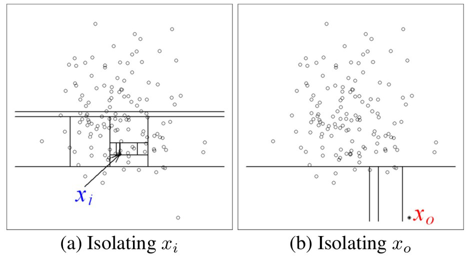
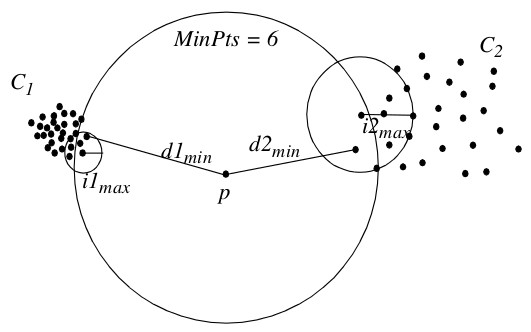

# Corpus

Twitter provides us with vast amounts of user-generated language data, which is a dream for anyone wanting to conduct textual analysis. The `twitteR` library provides access to Twitter data. Twitter marks its use as the ‘official’ way to download its tweets. An attractive and ‘easy-to-use’ alternative to Twitter’s ‘official rules’ is based on the use of the `rtweet` package. The [following link](https://github.com/ropensci/rtweet) seems to be a more updated package. This [set of slides](https://mkearney.github.io/nicar_tworkshop/) offers an easy-to-follow tutorial, showing the pipeline that you need.

Twitter’s link to create Twitter applications is https://developer.twitter.com/en/apps. You need to be logged in to Twitter to create a new app. This will provide you a set of 5 items related to the application called `app` `consumerKey`, `consumerSecret`, `accessToken` and `accessSecret`. Both `accessToken` and `accessSecret` need to be activated after receiving the `consumerKey` and `consumerSecret`. Five parameters need to be used in the final authentification function call, `create_token()`.

```
token <- create_token(
    app = app,
    consumer_key = consumer_key,
    consumer_secret = consumer_secret,
    access_token = access_key,
    access_secret = access_secret
)
```

Once the authentification is done, tweets of any user or hashtag can be retrieved and converted to a corpus. In this case, I have decided to make a corpus with the tweets of two mobile game accounts. As they are similar games, performing classification of tweets will be a challenging task. Only the last 1000 tweets of each account are retrieved.

Therefore, we have a binary classification problem, where the class is `clashroyale` or `clashofclans`. As we are working with text, the predictive features that we have are related to words.

```{r}
library(rtweet)
# retrieve user tweets
n <- 1000
clashroyale_tweets <- get_timeline("clashroyale", n = n)
clashofclans_tweets <- get_timeline("clashofclans", n = n)
```

We can see the first 5 tweets of each dataset. Apart from the text, many other data is return by the previous function. In total, there are 90 columns, but we will only use a few of them. The most important one is the `text` column. We will use some other features such as the date for visualization.

```{r}
head(clashroyale_tweets, n = 5L)
head(clashofclans_tweets, n = 5L)
clashroyale_tweets$text[1:5]
clashofclans_tweets$text[1:5]
```

We can use the `tm` library to build a corpus for each class. Each tweet will be a document in this corpus. Then we can merge them to have a single corpus. Building a corpus is recommended because the `tm` package offers many transformations for preprocessing text.

```{r}
library(tm)
# combine both frames in a single, binary, annotated set
tweets <- rbind(clashroyale_tweets, clashofclans_tweets)
# interpreting each element of the annotated vector as a document
clashroyale_docs <- VectorSource(clashroyale_tweets$text)
clashofclans_docs <- VectorSource(clashofclans_tweets$text)
# convert to a corpus: supervised classification to be applied in future steps
clashroyale_corpus <- VCorpus(clashroyale_docs)
clashofclans_corpus <- VCorpus(clashofclans_docs)
# merge, concatenate both groups-corpuses
corpus <- c(clashroyale_corpus, clashofclans_corpus)
```

# Visualization

Visualizing the data is important to understand our corpus. In this section there are various time series plots, donut plots and wordclouds.

## Time Series Plot

We can use the `rtweet` package get a time series plot with the frequencies of tweets. In these examples, I analyse the frequencies of both accounts by month, week and day. The tweet frequencies are similar, Clash Royale has more tweets.

```{r}
ts_plot(dplyr::group_by(tweets, screen_name), "month") +
    ggplot2::theme_minimal() +
    ggplot2::theme(plot.title = ggplot2::element_text(face = "bold")) +
    ggplot2::labs(
        x = "Date", y = "Count",
        title = "Frequency of Tweets from Clash Royale and Clash of Clans",
        subtitle = "Tweet counts aggregated by month"
    )
```

```{r}
ts_plot(dplyr::group_by(tweets, screen_name), "week") +
    ggplot2::theme_minimal() +
    ggplot2::theme(plot.title = ggplot2::element_text(face = "bold")) +
    ggplot2::labs(
        x = "Date", y = "Count",
        title = "Frequency of Tweets from Clash Royale and Clash of Clans",
        subtitle = "Tweet counts aggregated by week"
    )
```

```{r}
ts_plot(dplyr::group_by(tweets, screen_name), "day") +
    ggplot2::theme_minimal() +
    ggplot2::theme(plot.title = ggplot2::element_text(face = "bold")) +
    ggplot2::labs(
        x = "Date", y = "Count",
        title = "Frequency of Tweets from Clash Royale and Clash of Clans",
        subtitle = "Tweet counts aggregated by day"
    )
```

## Tweet Types Chart

Analysing the ratio of quotes, replies, retweets and organic tweets can tell us the type of tweets we are analysing. We could choose to only keep organic tweets for our corpus. Removing retweets might reduce the variability of the data and therefore, make it easier to classify. This time we will keep all tweet types, but we will still visualize the types in a donut chart.

As a first step we have to divide each account tweets into the previously mentioned subsets.

```{r}
tweet_types <- function(tweets) {
    organic <- tweets[tweets$is_retweet == FALSE, ]
    # Remove replies
    organic <- subset(organic, is.na(organic$reply_to_status_id))
    # Remove quotes
    organic <- organic[organic$is_quote == FALSE, ]
    # Keeping only the retweets
    retweets <- tweets[tweets$is_retweet == TRUE, ]
    # Keeping only the replies
    replies <- subset(tweets, !is.na(tweets$reply_to_status_id))
    # Keeping only the quotes
    quotes <- tweets[tweets$is_quote == TRUE, ]
    types_list <- list(organic, retweets, replies, quotes)
    return(types_list)
}
```

```{r}
# get clashroyale tweet types
clashroyale_types <- tweet_types(clashroyale_tweets)
clashroyale_organic <- clashroyale_types[[1]]
clashroyale_retweets <- clashroyale_types[[2]]
clashroyale_replies <- clashroyale_types[[3]]
clashroyale_quotes <- clashroyale_types[[4]]

# get clashofclans tweet types
clashofclans_types <- tweet_types(clashofclans_tweets)
clashofclans_organic <- clashofclans_types[[1]]
clashofclans_retweets <- clashofclans_types[[2]]
clashofclans_replies <- clashofclans_types[[3]]
clashofclans_quotes <- clashofclans_types[[4]]
```

Then, we create a separate data frame containing the number of organic tweets, retweets, replies and quotes. We have to prepare the data frame for a donut chart. This includes adding columns that calculate the ratios and percentages and some visualisation tweaks such as specifying the legend and rounding up your data.

```{r}
type_data <- function(organic, retweets, replies, quotes) {
    # Creating a data frame
    data <- data.frame(
        category = c("Organic", "Retweets", "Replies", "Quotes"),
        count = c(dim(organic)[1], dim(retweets)[1], dim(replies)[1], dim(quotes)[1])
    )

    # Adding columns
    data$fraction <- data$count / sum(data$count)
    data$percentage <- data$count / sum(data$count) * 100
    data$ymax <- cumsum(data$fraction)
    data$ymin <- c(0, head(data$ymax, n = -1))

    # Rounding the data to two decimal points
    data[, -1] <- round(data[, -1], 2)
    return(data)
}
```

```{r}
library(ggplot2)
clashroyale_data <- type_data(clashroyale_organic, clashroyale_retweets, clashroyale_replies, clashroyale_quotes)
type <- paste(clashroyale_data$category, clashroyale_data$percentage, "%")
ggplot(clashroyale_data, aes(ymax = ymax, ymin = ymin, xmax = 4, xmin = 3, fill = type)) +
    geom_rect() +
    coord_polar(theta = "y") +
    xlim(c(2, 4)) +
    theme_void() +
    theme(legend.position = "right") +
    labs(title = "Clash Royale Tweet Types")
```

```{r}
clashofclans_data <- type_data(clashofclans_organic, clashofclans_retweets, clashofclans_replies, clashofclans_quotes)
type <- paste(clashofclans_data$category, clashofclans_data$percentage, "%")
ggplot(clashofclans_data, aes(ymax = ymax, ymin = ymin, xmax = 4, xmin = 3, fill = type)) +
    geom_rect() +
    coord_polar(theta = "y") +
    xlim(c(2, 4)) +
    theme_void() +
    theme(legend.position = "right") +
    labs(title = "Clash of Clans Tweet Types")
```

## Initial Wordclouds

Before starting learning the exposed machine learning models, let’s build a wordcloud with the following package [3]. Its `wordcloud()` command needs the list of words and their frequencies as parameters. As the words appear in columns in the document-term matrix, the `colSums` command is used to calculate the word frequencies. In order to complete the needed calculations, note that the term-document matrix needs to be transformed (casted) to a matrix form with the `as.matrix` cast-operator.

```{r}
library(wordcloud)
corpus_dtm <- DocumentTermMatrix(corpus)
word_freqs <- sort(colSums(as.matrix(corpus_dtm)[1:n, ]), decreasing = TRUE)
wordcloud(words = names(word_freqs), freq = word_freqs, max.words = 100, random.order = FALSE, colors = brewer.pal(8, "Dark2"))
```

```{r}
word_freqs <- sort(colSums(as.matrix(corpus_dtm)[(n + 1):(n + n), ]), decreasing = TRUE)
wordcloud(words = names(word_freqs), freq = word_freqs, max.words = 100, random.order = FALSE, colors = brewer.pal(8, "Dark2"))
```

## Better Wordclouds

```{r}
wordcloud(clashroyale_tweets$text, max.words = 50, scale = c(3.5, 0.25), random.order = FALSE, colors = brewer.pal(8, "Dark2"))
```

```{r}
wordcloud(clashroyale_tweets$text, max.words = 50, scale = c(3.5, 0.25), random.order = FALSE, colors = brewer.pal(8, "Dark2"))
```

## Hashtag Worldclouds

```{r}
clashroyale_tweets$hashtags <- as.character(clashroyale_tweets$hashtags)
clashroyale_tweets$hashtags <- gsub("c\\(", "", clashroyale_tweets$hashtags)
wordcloud(clashroyale_tweets$hashtags, min.freq = 1, scale = c(3.5, .5), max.words = 50, random.order = FALSE, rot.per = 0.35, colors = brewer.pal(8, "Dark2"))
```

```{r}
clashofclans_tweets$hashtags <- as.character(clashofclans_tweets$hashtags)
clashofclans_tweets$hashtags <- gsub("c\\(", "", clashofclans_tweets$hashtags)
wordcloud(clashofclans_tweets$hashtags, min.freq = 1, scale = c(3.5, .5), max.words = 50, random.order = FALSE, rot.per = 0.35, colors = brewer.pal(8, "Dark2"))
```

# Preprocessing

## Apply Transformations

Transformations operators to the corpus are applied via `tm_map` function, which applies (maps) a function to all elements of the corpus. As the same transformations will be applied to both “science” and “religion” newsgroups, both corpus are merged using base function `c()`: this `c()` operator concatenates objects. This operation raises a collection of 968 documents. Function tm map applies transformations to corpus objects. The list of available transformations can be obtained consulting the help of ?getTransformations. Function content transformer is used to apply customized transformations. We apply several transformations. As NLP practitioner: consult the help and parameters of each transformation’s functions, of course, use them in a different and richer way then me.

```{r}
remove_urls <- function(text) {
    gsub("http\\S*", "", text)
}
remove_mentions <- function(text) {
    gsub("@\\S*", "", text)
}
remove_hashtags <- function(text) {
    gsub("#\\S*", "", text)
}
remove_newlines <- function(text) {
    gsub("\\\n", " ", text)
}
remove_emojis <- function(text) {
    gsub("[^\x01-\x7F]", "", text)
}
```

```{r}
# remove numbers
corpus_trans <- tm_map(corpus, removeNumbers)
# remove punctuation
corpus_trans <- tm_map(corpus_trans, removePunctuation)
# remove urls
corpus_trans <- tm_map(corpus_trans, content_transformer(remove_urls))
# remove mentions
corpus_trans <- tm_map(corpus_trans, content_transformer(remove_mentions))
# remove hastags
corpus_trans <- tm_map(corpus_trans, content_transformer(remove_hashtags))
# remove newlines
corpus_trans <- tm_map(corpus_trans, content_transformer(remove_newlines))
# remove emojis
corpus_trans <- tm_map(corpus_trans, content_transformer(remove_emojis))
# convert to lowercase
corpus_trans <- tm_map(corpus_trans, content_transformer(tolower))
# remove english stop words
corpus_trans <- tm_map(corpus_trans, removeWords, stopwords("english"))
# strip whitespace
corpus_trans <- tm_map(corpus_trans, stripWhitespace)
# to access Porter's word stemming algorithm
library(SnowballC)
corpus_trans <- tm_map(corpus_trans, stemDocument)
```

```{r}
for (i in 1:5) {
    print(corpus_trans[[i]]$content)
}
for (i in (n + 1):(n + 6)) {
    print(corpus_trans[[i]]$content)
}
```

## Create Document-Term Matrix

After corpus set transformation, a common approach in text mining is to **create a document-term matrix** from a corpus. Its transpose operator creates a term-document matrix. This document-term matrix is the starting point to apply machine-learning modelization techniques such as classification, clustering, etc. Different operations can be applied over this matrix. We can obtain the terms that occur at least, let say, 15 times; or consult the **terms that associate** with at least, for example, by a 0.7 correlation degree with the term “young”.

```{r}
corpus_dtm <- DocumentTermMatrix(corpus_trans)
dim(corpus_dtm)
findFreqTerms(corpus_dtm, 15)
findAssocs(corpus_dtm, term = "clan", corlimit = 0.7)
```

## Remove Sparse Terms

After all, it is easy no note the huge degree of sparsity of this matrix: a low amount of non-zero elements. Thus, one of the most important operations is to remove sparse terms, i.e., terms occurring in very few documents. The `sparse` parameter in the `removeSparseTerms` function refers to the maximum sparseness allowed: the smaller its proportion, fewer terms (but more common) will be retained. A “trial and error” approach will finally return a proper number of terms. This matrix will be the starting point for building further machine learning models (in the next tutorial).

```{r}
corpus_dtm_95 <- removeSparseTerms(corpus_dtm, sparse = 0.95)
corpus_dtm_95
barplot(as.matrix(corpus_dtm_95),
    xlab = "terms", ylab = "number of occurrences",
    main = "Most frequent terms (sparseness=0.95)"
)
corpus_dtm_97 <- removeSparseTerms(corpus_dtm, sparse = 0.97)
corpus_dtm_97
barplot(as.matrix(corpus_dtm_97),
    xlab = "terms", ylab = "number of occurrences",
    main = "Most frequent terms (sparseness=0.97)"
)
corpus_dtm_99 <- removeSparseTerms(corpus_dtm, sparse = 0.99)
corpus_dtm_99
terms <- dim(corpus_dtm_99)[2]
barplot(as.matrix(corpus_dtm_99),
    xlab = "terms", ylab = "number of occurrences",
    main = "Most frequent terms (sparseness=0.99)"
)
```

## Final Worldclouds


```{r}
# calculate the frequency of words and sort in descending order.
word_freqs <- sort(colSums(as.matrix(corpus_dtm_99)[1:n, ]), decreasing = TRUE)
wordcloud(words = names(word_freqs), freq = word_freqs, max.words = 50, scale = c(3.5, 0.25), random.order = FALSE, colors = brewer.pal(8, "Dark2"))
```

```{r}
word_freqs <- sort(colSums(as.matrix(corpus_dtm_99)[(n + 1):(n + n), ]), decreasing = TRUE)
wordcloud(words = names(word_freqs), freq = word_freqs, max.words = 50, scale = c(3.5, 0.25), random.order = FALSE, colors = brewer.pal(8, "Dark2"))
```

# Outlier Detection

## Isolation Forest



```{r}
library(solitude)
# Empty tree structure
iso <- isolationForest$new()

# convert dtm to dataframe
corpus_df_99 <- as.data.frame(as.matrix(corpus_dtm_99))

# Learn the IsolationForest for our data
iso$fit(corpus_df_99)

# predict for our data
p <- iso$predict(corpus_df_99)

# plot anomaly score
plot(density(p$anomaly_score), main = "Anomaly Score Density")

# Based on the plot, decide the cut-off point
which(p$anomaly_score > 0.62)
```

## Local Outlier Factor (LOF)



```{r}
library(DDoutlier)
# calculate "outlierness" score, by LOF
outlierness <- LOF(dataset = corpus_df_99, k = 5)

# assign an index to outlierness values
names(outlierness) <- seq_len(nrow(corpus_df_99))

# plot histogram
hist(outlierness)

# Based on the plot, decide the cut-off point
unique(which(outlierness > 3.5))
```

# Clustering

## Clustering of words with similar patterns of occurrences across documents

We try to find clusters of words with hierarchical clustering, a popular clustering techniques which builds a dendogram to iteratively group pairs of similar objects. To do so, a matrix which has removed sparse is needed: the starting point is the 0.8 sparseness-value matrix. After the application of the matrix-casting operator, number of occurrences are scaled: first column (term) mean is substracted, and then this is divided by its standard deviation. It is needed to calculate the distance between pairs of objects (terms): these are saved in `dist_matrix`. The `dist` operator performs this calculation between pairs of rows of the provided matrix. As terms appear in the columns of the document-term matrix (`corpus_dtm_80`), it is needed to be transposed by means of the `t` operator. The clustering-dendogram is built with the `hclust` operator. It needs as input the calculated distance matrix between pairs of terms and a criteria to decide which pair of clusters to be consecutively joined in the bottom-up dendogram. In this case, the “complete” criteria takes into account the maximum distance between any pair of objects (terms) of both clusters to be merged. Heigth in the dendogram denotes the *distance* between a merged pair of clusters.

```{r}
dist_matrix <- dist(t(scale(as.matrix(corpus_dtm_95))))
term_clustering <- hclust(dist_matrix, method = "complete")
plot(term_clustering)
```

Instead of hierarchical clustering and following a similar set of functions, the `fpc` package allows to construct a `k-means` clustering.


## Clustering of documents

Another type of popular NLP machine-learning analysis is to construct clusters of similar documents based on the frequencies of word occurrences.

```{r}
dist_matrix <- dist(scale(as.matrix(corpus_dtm_95)))
groups <- hclust(dist_matrix, method = "ward.D")
plot(groups, cex = 0.9, hang = -1)
rect.hclust(groups, k = 5)
```

# Classification

The `caret` [4, 5] package is the reference tool for building supervised classification and regression models in R. The following shows the current top machine learning packages in `R`: https://www.kdnuggets.com/2017/02/top-r-packages-machine-learning.html. `caret` package covers all the steps of a classic pipeline: data preprocessing, model building, accuracy estimation, prediction of the type of new samples, and statistical comparision between the performance of different models. Another similar package is `mlr3`. If you are interested, you can find an interesting tutorial: https://mlr3.mlr-org.com/.

Very useful: the cheatsheet of caret: https://github.com/CABAH/learningRresources/blob/main/cheatsheets/caret.pdf. Its principal functions illustrated in a single page.

Our objective is to learn a classifier-model which, based on terms occurrences, predicts the type-topic (“science-electronics” or “religion”) of future documents (post-new, in the case of newsgroups). We have a two-class problem.

## Concatenate the annotation column: type of training documents

The 0.9 sparseness value document-term matrix is our starting point. We first need to append the class (document type) vector as the last column of the matrix: the first 591 documents cover the “science-electronics” newgroup.

```{r}
dim(corpus_dtm_99)
type <- c(rep("clashroyale", n), rep("clashofclans", n)) # create the type vector
corpus_dtm_99 <- cbind(corpus_dtm_99, type) # append
dim(corpus_dtm_99) # consult the updated number of columns
```

This new matrix is the starting point for any software specialized on supervised classification. However, it is needed to concatenate “matrix” and “data.frame” casting operations. The name of the last column is updated.

```{r}
corpus_df_99 <- as.data.frame(as.matrix(corpus_dtm_99))
colnames(corpus_df_99)[terms + 1] <- "type"
corpus_df_99$type <- as.factor(corpus_df_99$type)
corpus_df_99 <- as.data.frame(sapply(corpus_df_99, as.numeric))
corpus_df_99[is.na(corpus_df_99)] <- 0
corpus_df_99$type <- as.factor(corpus_df_99$type)
```

The different columns of an object can be accessed by typing the tab after the object name and the $ symbol.

## Create a "Train-Test" partition for classifier validation

Before learning a classification model it is needed to define the subsets of samples (documents) to train and test the it. The `createDataPartition` produces a train-test partition of our corpus of 968 documents. This will be maintained during the whole pipeline of analysis. Test samples won’t be used for any modeling decision: only to predict their class and create a confusion matrix. Consult the parameters of `createDataPartition`, as well as other two functions with similar purposes, `createFolds` and `createResample`. A list of randomly sampled numbers (object `in_train`), as index numbers, is used to partition the whole corpus in two `R` objects.

```{r}
library(caret)
set.seed(107) # a random seed to enable reproducibility
in_train <- createDataPartition(y = corpus_df_99$type, p = .75, list = FALSE)
str(in_train)
training <- corpus_df_99[in_train, ]
testing <- corpus_df_99[-in_train, ]
nrow(training)
```

## Selection of supervised classification algorithms 

We now can start training and testing different supervised classification models. train function implements the building process. Check its parameters: among them, we highlight the following:

* `preProcess` parameter defines the preprocessing steps to be applied. They are popular with classic numeric variables, such as imputation of missing values, centering and scaling, etc. As it was shown in the previous tutorial, NLP datasets have their own preprocessing tools. They are not going to be applied in our dataset.

* `trControl` parameter defines the method to estimate the error of the classifier. It is defined by means of the application of the `trainControl` function. This allows the use of different performance estimation procedures such as k-fold cross-validation, bootstrapping, etc. We apply a 10-fold cross-validation, repeated 3 times.

* `method` parameter fixes the type of classification algorithm to be learned. The wide list of algorithms (and its parameters) covered by `caret` can be found in https://topepo.github.io/caret/train-models-by-tag.html. Taking into account the large dimensionality of classic NLP datasets, the use of classifiers capable to deal with this characteristic is highly recommended. In this tutorial, Linear support vector machine (SVM) and k-nearest neighbour (K-NN) models are learned and validated.

* `metric` parameter fixes the score to assess-validates the goodness of each model. Apart from the ROC metric used in this tutorial, a large set of metrics is offered: Accuracy (percentage of correct classification), kappa, Sens (Sensitivity), Specificity (Spec), RMSE in the case of regression problems... I have not found a list with all the metrics offered by `caret`, but consulting the help of the package will give you a broad idea.

Take into account the following facts about the model-training step:

* the expression `type ~` is quite popular in R to denote the specific variable to be predicted, followed by the set of predictors. A point indicates that the rest of variables are used as predictors.

* together with the estimation of the percentage recognition (accuracy), the value of the *Kappa statistic* is shown. It is a popular score in NLP studies. Its definition is not trivial in the context of supervised classification. Roughly, this score compares the “observed” accuracy of the learned classifier with respect to a random classifier: measuring the score difference between our classifier and a random classifier. A larger definition of this metric can be found in http://stats.stackexchange.com/questions/82162/kappa-statistic-in-plain-english.

* while the linear SVM classifier does not have parameters, K-NN has the “number of neighbours” (K) key parameter. By default, changing the value of the parameter, `caret` evaluates 3 models (`tuneLength` equal to 3). The `tuneLength` option of the `train` function fixes the number of values of each parameter to be checked. For example, if the classifier has 2 parameters and the `tuneLength` parameter is not changed, 3 x 3 = 9 models are evaluated. The `tuneGrid` option offers the possibility to select among a set of values to be tuned-tested.

* `caret` supports more than 150 supervised classification and regression algorithms. A small portion of them are learned by means of the software of the package itself. The majority of the algorithms are learned by other `R` packages which are conveniently accessed by `caret`.

## Internal performance estimation in the training partition

```{r}
library("doParallel")
cl <- makeCluster(parallel::detectCores() - 1)
registerDoParallel(cl)
```

```{r}
# fixing the performance estimation procedure
train_ctrl <- trainControl(method = "repeatedcv", repeats = 3)
lr_3x10cv <- train(type ~ ., data = training, method = "LogitBoost", trControl = train_ctrl)
lr_3x10cv
lda_3x10cv <- train(type ~ ., data = training, method = "lda", trControl = train_ctrl)
lda_3x10cv
```

## Tuning of the parameters of the selected classifiers

The training process can still be enriched with extra parameters in the `trainControl` function: `summaryFunction` controls the type of evaluation metrics. In binary classification problems (e.g. “science” versus “religion”) the `twoClassSummary` option displays [area under the ROC curve](http://en.wikipedia.org/wiki/Receiver_operating_characteristic), sensitity-recall and specificity metrics. To do so, it is also needed to activate the `classProbs` option which saves the probability that the classifier assigns to each sample belonging to each class-value.

```{r}
train_ctrl <- trainControl(
    method = "repeatedcv", repeats = 3
)
lr_tune_3x10cv <- train(type ~ .,
    data = training, method = "LogitBoost", trControl = train_ctrl, tuneLength = 10
)
lr_tune_3x10cv
plot(lr_tune_3x10cv)
```

## Predict the class-type of future unseen-unlabeled texts

In order to predict the class value of unseen documents of the test partition caret uses the classifier which shows the best accuracy estimation of their parameters. Function predict implements this functionality. Consult its parameters. The `type` parameter, by means of its `probs` value, outputs the probability of test each sample belonging to each class (“a-posteriori” probability). On the other hand, the `raw` value outputs the class value with the largest probability. By means of the `raw` option the confusion matrix can be calculated: this crosses, for each test sample, predicted with real class values.

```{r}
lr_classes <- predict(lr_3x10cv, newdata = testing, type = "raw")
confusionMatrix(data = lr_classes, testing$type)
```

```{r}
lda_classes <- predict(lda_3x10cv, newdata = testing, type = "raw")
confusionMatrix(data = lda_classes, testing$type)
```

## Statistical comparison between two classifiers by means of t-test

Can a statistical comparison be performed between the 3x10cv validation results of K-NN and SVM? Note than in our case, due to the 3 repetitions of the 10-fold cross-validation process, there are 30 resampling results for each classifier. First, results of both classifiers are crossed using the `resamples` function. As the `set.seed` did not change, the same paired cross-validation subsets of samples were used for both classifiers. This forces to use a paired t-test to calculate the significance of the differences between both classifiers. A simple plot is drawn, showing the accuracy differences between both models for each of the 30 cross-validation folds: note that rf has a better accuracy than lda for all the cross-validation fold results (Figure 2).

Using the `diff` function over the `resamps` object which saves the “crossing” of both classifiers, we can show a rich output of the performed comparison: each number matters. The output shows, for each metric (area under the ROC curve, sensitivity, specificity), the difference of the mean (positive or negative, following the order in the `resamples` function) between both classifiers. The p-value of the associated t-test is also shown.

The interpretation of the p-value has the key. It is related with the risk of erroneously discarding the nullhypothesis of similarity between compared classifiers, when there is no real difference. Roughly speaking, it can also be interpreted as the degree of similarity between both classifiers. A p-value smaller than 0.05 (or 0.1, depending on your interpretation and threshold) alerts about statistically significant differences between both classifiers, https://en.wikipedia.org/wiki/Statistical_significance. That is, when the risk of erroneusly discarding the hypothesis of similarity between both classifiers is low, we assume that there is a statistically significant difference between classifiers.

```{r}
resamps <- resamples(list(lda = lda_3x10cv, lr = lr_3x10cv))
summary(resamps)
xyplot(resamps, what = "BlandAltman")
diffs <- diff(resamps)
summary(diffs)
```

# Feature Selection

## Univariate Filters

```{r}
sbf_ctrl <- sbfControl(functions = rfSBF, method = "repeatedcv", repeats = 3)
train_ctrl <- trainControl(method = "repeatedcv", repeats = 3, classProbs = TRUE)
lr_sbf_3x10cv <- sbf(type ~ ., data = training, method = "LogitBoost", trControl = train_ctrl, sbfControl = sbf_ctrl)
lr_sbf_3x10cv
lda_sbf_3x10cv <- sbf(type ~ ., data = training, method = "lda", trControl = train_ctrl, sbfControl = sbf_ctrl)
lda_sbf_3x10cv
```

```{r}
resamps <- resamples(list(lr = lr_3x10cv, lr_sbf = lr_sbf_3x10cv))
summary(resamps)
xyplot(resamps, what = "BlandAltman")
diffs <- diff(resamps)
summary(diffs)
```

```{r}
resamps <- resamples(list(lda = lda_3x10cv, lda_sbf = lda_sbf_3x10cv))
summary(resamps)
xyplot(resamps, what = "BlandAltman")
diffs <- diff(resamps)
summary(diffs)
```

## Recursive Feature Elimination

```{r}
rfe_ctrl <- rfeControl(functions = rfFuncs, method = "repeatedcv", repeats = 3)
train_ctrl <- trainControl(method = "repeatedcv", repeats = 3)
lr_rfe_3x10cv <- rfe(type ~ ., data = training, method = "LogitBoost", trControl = train_ctrl, rfeControl = rfe_ctrl)
lr_rfe_3x10cv
lda_rfe_3x10cv <- rfe(type ~ ., data = training, method = "lda", trControl = train_ctrl, rfeControl = rfe_ctrl)
lda_rfe_3x10cv
```

```{r}
resamps <- resamples(list(lr = lr_3x10cv, lr_rfe = lr_rfe_3x10cv))
summary(resamps)
xyplot(resamps, what = "BlandAltman")
diffs <- diff(resamps)
summary(diffs)
```

```{r}
resamps <- resamples(list(lda = lda_3x10cv, lda_rfe = lda_rfe_3x10cv))
summary(resamps)
xyplot(resamps, what = "BlandAltman")
diffs <- diff(resamps)
summary(diffs)
```

## Genetic Algorithms

```{r}
gafs_ctrl <- gafsControl(functions = caretGA, method = "repeatedcv", repeats = 3)
train_ctrl <- trainControl(method = "repeatedcv", repeats = 3)
lr_gafs_3x10cv <- gafs(x = training[, -ncol(training)], y = training$type, method = "LogitBoost", trControl = train_ctrl, gafsControl = gafs_ctrl)
lr_gafs_3x10cv
lda_gafs_3x10cv <- gafs(x = training[, -ncol(training)], y = training$type, method = "lda", trControl = train_ctrl, gafsControl = gafs_ctrl)
lda_gafs_3x10cv
```

```{r}
resamps <- resamples(list(lr = lr_3x10cv, lr_gafs = lr_gafs_3x10cv))
summary(resamps)
xyplot(resamps, what = "BlandAltman")
diffs <- diff(resamps)
summary(diffs)
```

```{r}
resamps <- resamples(list(lda = lda_3x10cv, lda_gafs = lda_gafs_3x10cv))
summary(resamps)
xyplot(resamps, what = "BlandAltman")
diffs <- diff(resamps)
summary(diffs)
```

## Simuated Annealing

```{r}
safs_ctrl <- safsControl(functions = caretSA, method = "repeatedcv", repeats = 3)
train_ctrl <- trainControl(method = "repeatedcv", repeats = 3)
lr_safs_3x10cv <- safs(x = training[, -ncol(training)], y = training$type, method = "LogitBoost", trControl = train_ctrl, safsControl = safs_ctrl)
lr_safs_3x10cv
lda_safs_3x10cv <- safs(x = training[, -ncol(training)], y = training$type, method = "lda", trControl = train_ctrl, safsControl = safs_ctrl)
lda_safs_3x10cv
```

```{r}
resamps <- resamples(list(lr = lr_3x10cv, lr_safs = lr_safs_3x10cv))
summary(resamps)
xyplot(resamps, what = "BlandAltman")
diffs <- diff(resamps)
summary(diffs)
```

```{r}
resamps <- resamples(list(lda = lda_3x10cv, lda_safs = lda_safs_3x10cv))
summary(resamps)
xyplot(resamps, what = "BlandAltman")
diffs <- diff(resamps)
summary(diffs)
```

# Feature Extraction

## Principal Component Analysis

```{r}
pca_res <- prcomp(scale(training[, -ncol(training)]))
var_explained <- pca_res$sdev^2 / sum(pca_res$sdev^2)
var_explained[1:5]
plot(var_explained)
```

```{r}
library(tidyverse)
pca_res$x %>%
    as.data.frame() %>%
    ggplot(aes(x = PC1, y = PC2)) +
    geom_point(size = 4) +
    theme_bw(base_size = 32) +
    labs(
        x = paste0("PC1: ", round(var_explained[1] * 100, 1), "%"),
        y = paste0("PC2: ", round(var_explained[2] * 100, 1), "%")
    ) +
    theme(legend.position = "top")
```

```{r}
# fixing the performance estimation procedure
train_ctrl <- trainControl(method = "repeatedcv", repeats = 3)
lr_pca_3x10cv <- train(type ~ ., data = training, method = "LogitBoost", preProcess = c("center", "scale", "pca"), trControl = train_ctrl)
lr_pca_3x10cv
lda_pca_3x10cv <- train(type ~ ., data = training, method = "lda", preProcess = c("center", "scale", "pca"), trControl = train_ctrl)
lda_pca_3x10cv
```

```{r}
resamps <- resamples(list(lr = lr_3x10cv, lr_pca = lr_pca_3x10cv))
summary(resamps)
xyplot(resamps, what = "BlandAltman")
diffs <- diff(resamps)
summary(diffs)
```

```{r}
resamps <- resamples(list(lda = lda_3x10cv, lda_pca = lda_pca_3x10cv))
summary(resamps)
xyplot(resamps, what = "BlandAltman")
diffs <- diff(resamps)
summary(diffs)
```

# Bibliography

[1] Ingo Feinerer. tm: Text Mining Package, 2012. R package version 0.5-7.1.

[2] Ingo Feinerer, Kurt Hornik, and David Meyer. Text mining infrastructure in R. Journal of Statistical Software, 25(5):1-54, 3 2008.

[3] Ian Fellows. wordcloud: Word Clouds, 2014. R package version 2.5.

[4] M. Kuhn and K. Johnson. Applied Predictive Modeling. Springer, 2013.

[5] Max Kuhn. Contributions from Jed Wing, Steve Weston, Andre Williams, Chris Keefer, Allan Engelhardt, Tony Cooper, Zachary Mayer, and the R Core Team. caret: Classification and Regression Training, 2014. R package version 6.0-35.
