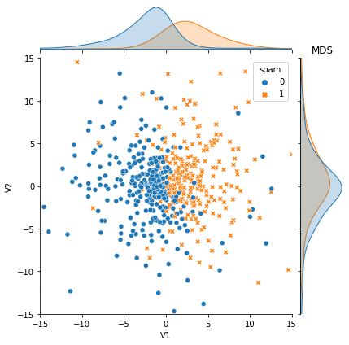

This R package provides implementations of several semi-supervised learning methods. The code can be found on [Github](https://github.com/jkrijthe/RSSL). It is described in the following paper: [arXiv](https://arxiv.org/pdf/1612.07993.pdf).

```{r}
library("RSSL")
set.seed(1)
```

# Classifiers

There are many classifiers available in the package. The main types are defined below: Least Squares Classifier, Linear Discriminant Analysis, Nearest Mean Classifier, Support Vector Machine and Logistic Regression. They are used together with Self Learning. `classifiers` is a list of two classifiers, with one supervised classifier and one self learning classifier. Each
classifier is be a function that accepts 4 arguments: a
numeric design matrix of the labeled objects, a factor of labels,
a numeric design matrix of unlabeled objects and a factor of
labels for the unlabeled objects.

```{r}
classifiers_LS <- list("LS"=function(X, y, X_u, y_u) {
                        LeastSquaresClassifier(X, y, lambda=0)},
                    "Self"=function(X, y, X_u, y_u) {
                        SelfLearning(X, y, X_u, LeastSquaresClassifier)})

classifiers_LD <- list("LD"=function(X, y, X_u, y_u) {
                        LinearDiscriminantClassifier(X, y)},
                    "Self"=function(X, y, X_u, y_u) {
                        SelfLearning(X, y, X_u, LinearDiscriminantClassifier)})

classifiers_NM <- list("NM"=function(X, y, X_u, y_u) {
                        NearestMeanClassifier(X, y)},
                    "Self"=function(X, y, X_u, y_u) {
                        SelfLearning(X, y, X_u, NearestMeanClassifier)})

classifiers_SVM <- list("SVM"=function(X, y, X_u, y_u) {
                        SVM(X, y)},
                    "Self"=function(X, y, X_u, y_u) {
                        SelfLearning(X, y, X_u, SVM)})

classifiers_LR <- list("LR"=function(X, y, X_u, y_u) {
                        LogisticRegression(X, y)},
                    "Self"=function(X, y, X_u, y_u) {
                        SelfLearning(X, y, X_u, LogisticRegression)})

classifiers <- classifiers_LS
```

# Measures

There are five performance measures available: accuracy, error, test loss, labeled loss and train loss.
`measures` is a list of performance measures that we want to select. I remove error because having both accuracy and error is not necessary.

```{r}
measures <- list("Accuracy" = measure_accuracy,
                "Error" = measure_error,
                "Loss Test" = measure_losstest,
                "Loss Labeled" = measure_losslab,
                "Loss Train" = measure_losstrain)

measures <- measures[names(measures) != "Error"]
```

# Artificial datasets

RSSL offers many artificial datasets. In the next sections I will generate and visualize them.


## 2ClassGaussian

Generate data from 2 Gaussian distributed classes.

```{r}
df <- generate2ClassGaussian(2000, d=2, var=0.6, expected=TRUE)

plot(df[,1],df[,2],col=df$Class,asp=1)
```

`LearningCurveSSL` evaluates semi-supervised classifiers for different amounts of
unlabeled training examples or different fractions of unlabeled
vs. labeled examples. This function allows for two different types of learning curves to
be generated. 

If `type="unlabeled"`, the number of labeled objects
remains fixed at the value of `n_l`, where `sizes` controls the
number of unlabeled objects. `n_test` controls the number of
objects used for the test set, while all remaining objects are
used if `with_replacement=FALSE` in which case objects are drawn
without replacement from the input dataset. We make sure each
class is represented by at least `n_min` labeled objects of each
class. For `n_l`, additional options include: "enough" which takes
the max of the number of features and 20, max(ncol(X)+5,20), "d"
which takes the number of features or "2d" which takes 2 times the
number of features.

```{r}
lc1 <- LearningCurveSSL(as.matrix(df[,1:2]),
                        df$Class, classifiers=classifiers, measures=measures,
                        type="unlabeled", n_l="enough", repeats=3)

plot(lc1)
```

If `type="fraction"` the total number of objects remains fixed,
while the fraction of labeled objects is changed. `frac` sets the
fractions of labeled objects that should be considered, while
`test_fraction` determines the fraction of the total number of
objects left out to serve as the test set.

```{r}
lc2 <- LearningCurveSSL(as.matrix(df[,1:2]),
                        df$Class, classifiers=classifiers, measures=measures,
                        type="fraction", test_fraction=0.5, repeats=3)

plot(lc2)
```

```{r}
lc2 <- LearningCurveSSL(as.matrix(df[,1:2]),
                        df$Class, classifiers=classifiers_LD, measures=measures,
                        type="fraction", test_fraction=0.5, repeats=3)

plot(lc2)
```

```{r}
lc2 <- LearningCurveSSL(as.matrix(df[,1:2]),
                        df$Class, classifiers=classifiers_NM, measures=measures,
                        type="fraction", test_fraction=0.5, repeats=3)

plot(lc2)
```

```{r}
lc2 <- LearningCurveSSL(as.matrix(df[,1:2]),
                        df$Class, classifiers=classifiers_SVM, measures=measures,
                        type="fraction", test_fraction=0.5, repeats=3)

plot(lc2)
```

```{r}
lc2 <- LearningCurveSSL(as.matrix(df[,1:2]),
                        df$Class, classifiers=classifiers_LR, measures=measures,
                        type="fraction", test_fraction=0.5, repeats=3)

plot(lc2)
```

## 2ClassGaussian (alt)

Generate data from 2 Gaussian distributed classes.

```{r}
df <- generate2ClassGaussian(2000, d=2, var=0.6, expected=FALSE)

plot(df[,1],df[,2],col=df$Class,asp=1)
```

## ABA

Generate data from 2 alternating classes.

```{r}
df <- generateABA(2000, d=2, var=0.6)

plot(df[,1],df[,2],col=df$Class,asp=1)
```

## CrescentMoon

```{r}
data<-generateCrescentMoon(150,2,1)
plot(data$X1,data$X2,col=data$Class,asp=1)
```

## FourClusters

```{r}
data <- generateFourClusters(1000,distance=6,expected=TRUE)
plot(data[,1],data[,2],col=data$Class,asp=1)
```
## FourClusters (alt)

```{r}
data <- generateFourClusters(1000,distance=6,expected=FALSE)
plot(data[,1],data[,2],col=data$Class,asp=1)
```

## ParallelPlanes

```{r}
data <- generateParallelPlanes(100,3)
plot(data[,1],data[,2],col=data$Class)
```

## SlicedCookie

```{r}
data <- generateSlicedCookie(1000,expected=TRUE)
plot(data[,1],data[,2],col=data$Class,asp=1)
```

## SlicedCookie (alt)

```{r}
data <- generateSlicedCookie(1000,expected=FALSE)
plot(data[,1],data[,2],col=data$Class,asp=1)
```

## TwoCircles

Generate data from 2 circles, one circle circumscribes the other.

```{r}
df <- generateTwoCircles(n = 100, noise_var = 0.2)

plot(df[,1],df[,2],col=df$Class,asp=1)
```

## Spirals

Generate Intersecting Spirals (3D).

```{r}
library(plot3D)
data <- generateSpirals(100, sigma=0.1)
plot3D::scatter3D(data$x, data$y, data$z, col=data$Class)
```

# Real datasets

## Iris


```{r}
data("iris")
lc2 <- LearningCurveSSL(as.matrix(iris[1:4]), iris$Species,
                        classifiers=classifiers, measures=measures,
                        type="fraction", fracs=seq(0.1,0.8,0.1),
                        test_fraction=0.5, repeats=3)

plot(lc2)
```

## Spambase



```{r}
spambase <- read.csv("../data/spambase.csv", header=TRUE, sep=",")
spambase$class = as.factor(spambase$class)
lc3 <- LearningCurveSSL(as.matrix(spambase[1:57]), spambase$class,
                        classifiers=classifiers, measures=measures,
                        type="fraction", fracs=seq(0.1,0.8,0.1),
                        test_fraction=0.5, repeats=3)

plot(lc3)
```

## UMIC-SA

```{r}
umic_sa <- read.csv("../data/UMIC-SA.csv", header=TRUE, sep=",")
umic_sa$class = as.factor(umic_sa$class)
lc4 <- LearningCurveSSL(as.matrix(umic_sa[2:1029]), umic_sa$class,
                        classifiers=classifiers, measures=measures,
                        type="fraction", fracs=seq(0.1,0.8,0.1),
                        test_fraction=0.5, repeats=3)

plot(lc4)
```

## Epinions

```{r}
epinions <- read.csv("../data/epinions.csv", header=TRUE, sep=",")
epinions$class = as.factor(epinions$class)
lc5 <- LearningCurveSSL(as.matrix(epinions[2:1015]), epinions$class,
                        classifiers=classifiers, measures=measures,
                        type="fraction", fracs=seq(0.1,0.8,0.1),
                        test_fraction=0.5, repeats=3)

plot(lc5)
```
