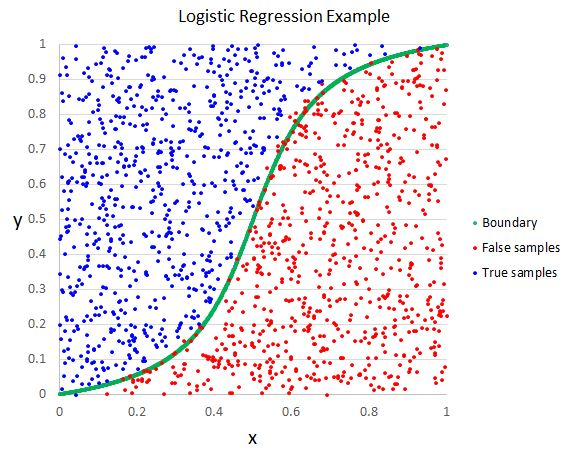

RSSL provides implementations of several semi-supervised learning methods. The code can be found on [Github](https://github.com/jkrijthe/RSSL). It is described in the following paper: [arXiv](https://arxiv.org/pdf/1612.07993.pdf). More R libraries are used in this notebook for visualization.

```{r}
library(RSSL)
library(ggplot2)
library(grid)
library(gridExtra)
library(plot3D)
set.seed(1)
```

# Classifiers

There are many classifiers available in the package. The main types are defined below: Least Squares Classifier, Linear Discriminant Analysis, Nearest Mean Classifier and Logistic Regression. They are used together with Self Learning and Expectation Maximization. `classifiers` is a list of two classifiers, with one supervised classifier and one self learning classifier. Each
classifier is a function that accepts 4 arguments: a
numeric design matrix of the labeled objects, a factor of labels,
a numeric design matrix of unlabeled objects and a factor of
labels for the unlabeled objects.


## Self Learning


## Expectation Maximization


## Least Squares Classifier


```{r}
classifiers_LS <- list(
    "LS" = function(X, y, X_u, y_u) {
        LeastSquaresClassifier(X, y, lambda = 0)
    },
    "SL" = function(X, y, X_u, y_u) {
        SelfLearning(X, y, X_u, LeastSquaresClassifier)
    },
    "EM" = function(X, y, X_u, y_u) {
        EMLeastSquaresClassifier(X, y, X_u)
    }
)
```

## Linear Discriminant Analysis


```{r}
classifiers_LD <- list(
    "LD" = function(X, y, X_u, y_u) {
        LinearDiscriminantClassifier(X, y)
    },
    "SL" = function(X, y, X_u, y_u) {
        SelfLearning(X, y, X_u, LinearDiscriminantClassifier)
    },
    "EM" = function(X, y, X_u, y_u) {
        EMLinearDiscriminantClassifier(X, y, X_u)
    }
)
```


## Nearest Mean Classifier


```{r}
classifiers_NM <- list(
    "NM" = function(X, y, X_u, y_u) {
        NearestMeanClassifier(X, y)
    },
    "SL" = function(X, y, X_u, y_u) {
        SelfLearning(X, y, X_u, NearestMeanClassifier)
    },
    "EM" = function(X, y, X_u, y_u) {
        EMNearestMeanClassifier(X, y, X_u)
    }
)
```

## Logistic Regression



```{r}
classifiers_LR <- list(
    "LR" = function(X, y, X_u, y_u) {
        LogisticRegression(X, y)
    },
    "SL" = function(X, y, X_u, y_u) {
        SelfLearning(X, y, X_u, LogisticRegression)
    }
)
```

# Measures

There are five performance measures available: accuracy, error, test loss, labeled loss and train loss. `measures` is a list of performance measures that we want to select. Our aim is to improve the accuracy on the test set (or reduce the error). We can look at the losses of each split to know how the model is learning. The time is also an important measure when working with big datasets.


```{r}
measures <- list(
    "Accuracy" = measure_accuracy,
    "Error" = measure_error,
    "Loss Test" = measure_losstest,
    "Loss Labeled" = measure_losslab,
    "Loss Train" = measure_losstrain
)
```

# Artificial datasets

RSSL offers many artificial datasets. In the next sections I will generate and visualize them.


## 2ClassGaussian

```{r}
data <- generate2ClassGaussian(2000, d = 2, var = 0.6, expected = TRUE)
plot(data[, 1], data[, 2], col = data$Class, asp = 1)
```

`LearningCurveSSL` evaluates semi-supervised classifiers for different amounts of
unlabeled training examples or different fractions of unlabeled
vs. labeled examples. This function allows for two different types of learning curves to
be generated. 

If `type="unlabeled"`, the number of labeled objects
remains fixed at the value of `n_l`, where `sizes` controls the
number of unlabeled objects. `n_test` controls the number of
objects used for the test set, while all remaining objects are
used if `with_replacement=FALSE` in which case objects are drawn
without replacement from the input dataset. We make sure each
class is represented by at least `n_min` labeled objects of each
class. For `n_l`, additional options include: "enough" which takes
the max of the number of features and 20, max(ncol(X)+5,20), "d"
which takes the number of features or "2d" which takes 2 times the
number of features.

```{r}
lc <- LearningCurveSSL(as.matrix(data[, 1:2]),
    data$Class,
    classifiers = classifiers_LS, measures = measures,
    type = "unlabeled", n_l = "enough", repeats = 3
)

plot(lc)
```

If `type="fraction"` the total number of objects remains fixed,
while the fraction of labeled objects is changed. `frac` sets the
fractions of labeled objects that should be considered, while
`test_fraction` determines the fraction of the total number of
objects left out to serve as the test set.

```{r}
lc <- LearningCurveSSL(as.matrix(data[, 1:2]),
    data$Class,
    classifiers = classifiers_LS, measures = measures,
    type = "fraction", test_fraction = 0.5, repeats = 3
)

plot(lc)
```

```{r}
lc <- LearningCurveSSL(as.matrix(data[, 1:2]),
    data$Class,
    classifiers = classifiers_LD, measures = measures,
    type = "fraction", test_fraction = 0.5, repeats = 3
)

plot(lc)
```

```{r}
lc <- LearningCurveSSL(as.matrix(data[, 1:2]),
    data$Class,
    classifiers = classifiers_NM, measures = measures,
    type = "fraction", test_fraction = 0.5, repeats = 3
)

plot(lc)
```

```{r}
lc <- LearningCurveSSL(as.matrix(data[, 1:2]),
    data$Class,
    classifiers = classifiers_LR, measures = measures,
    type = "fraction", test_fraction = 0.5, repeats = 3
)

plot(lc)
```

## 2ClassGaussian (alt)

```{r}
data <- generate2ClassGaussian(2000, d = 2, var = 0.6, expected = FALSE)
plot(data[, 1], data[, 2], col = data$Class, asp = 1)
```

```{r}
lc <- LearningCurveSSL(as.matrix(data[, 1:2]),
    data$Class,
    classifiers = classifiers_LS, measures = measures,
    type = "fraction", test_fraction = 0.5, repeats = 3
)

plot(lc)
```


## ABA

```{r}
data <- generateABA(2000, d = 2, var = 0.6)
plot(data[, 1], data[, 2], col = data$Class, asp = 1)
```

```{r}
lc <- LearningCurveSSL(as.matrix(data[, 1:2]),
    data$Class,
    classifiers = classifiers_LS, measures = measures,
    type = "fraction", test_fraction = 0.5, repeats = 3
)

plot(lc)
```

## CrescentMoon

```{r}
data <- generateCrescentMoon(150, 2, 1)
plot(data$X1, data$X2, col = data$Class, asp = 1)
```

```{r}
lc <- LearningCurveSSL(as.matrix(data[, 2:3]),
    data$Class,
    classifiers = classifiers_LS, measures = measures,
    type = "fraction", test_fraction = 0.5, repeats = 3
)

plot(lc)
```

## FourClusters

```{r}
data <- generateFourClusters(1000, distance = 6, expected = TRUE)
plot(data[, 1], data[, 2], col = data$Class, asp = 1)
```

```{r}
lc <- LearningCurveSSL(as.matrix(data[, 1:2]),
    data$Class,
    classifiers = classifiers_LS, measures = measures,
    type = "fraction", test_fraction = 0.5, repeats = 3
)

plot(lc)
```

## FourClusters (alt)

```{r}
data <- generateFourClusters(1000, distance = 6, expected = FALSE)
plot(data[, 1], data[, 2], col = data$Class, asp = 1)
```

```{r}
lc <- LearningCurveSSL(as.matrix(data[, 1:2]),
    data$Class,
    classifiers = classifiers_LS, measures = measures,
    type = "fraction", test_fraction = 0.5, repeats = 3
)

plot(lc)
```

## ParallelPlanes

```{r}
classifiers_LS_SL <- list(
    "LS" = function(X, y, X_u, y_u) {
        LeastSquaresClassifier(X, y, lambda = 0)
    },
    "SL" = function(X, y, X_u, y_u) {
        SelfLearning(X, y, X_u, LeastSquaresClassifier)
    }
)
```

```{r}
data <- generateParallelPlanes(100, 3)
plot(data[, 1], data[, 2], col = data$Class)
```

```{r}
lc <- LearningCurveSSL(as.matrix(data[, 1:2]),
    data$Class,
    classifiers = classifiers_LS_SL, measures = measures,
    type = "fraction", test_fraction = 0.5, repeats = 3
)

plot(lc)
```

## SlicedCookie

```{r}
data <- generateSlicedCookie(1000, expected = TRUE)
plot(data[, 1], data[, 2], col = data$Class, asp = 1)
```

```{r}
lc <- LearningCurveSSL(as.matrix(data[, 1:2]),
    data$Class,
    classifiers = classifiers_LS, measures = measures,
    type = "fraction", test_fraction = 0.5, repeats = 3
)

plot(lc)
```

## SlicedCookie (alt)

```{r}
data <- generateSlicedCookie(1000, expected = FALSE)
plot(data[, 1], data[, 2], col = data$Class, asp = 1)
```

```{r}
lc <- LearningCurveSSL(as.matrix(data[, 1:2]),
    data$Class,
    classifiers = classifiers_LS, measures = measures,
    type = "fraction", test_fraction = 0.5, repeats = 3
)

plot(lc)
```

## TwoCircles

```{r}
data <- generateTwoCircles(n = 100, noise_var = 0.2)
plot(data[, 1], data[, 2], col = data$Class, asp = 1)
```

```{r}
lc <- LearningCurveSSL(as.matrix(data[, 1:2]),
    data$Class,
    classifiers = classifiers_LS, measures = measures,
    type = "fraction", test_fraction = 0.5, repeats = 3
)

plot(lc)
```

## Spirals

```{r}
data <- generateSpirals(100, sigma = 0.1)
plot3D::scatter3D(data$x, data$y, data$z, col = data$Class)
```

```{r}
lc <- LearningCurveSSL(as.matrix(data[, 1:2]),
    data$Class,
    classifiers = classifiers_LS, measures = measures,
    type = "fraction", test_fraction = 0.5, repeats = 3
)

plot(lc)
```

# Real datasets

## Iris


```{r}
data("iris")
iris[sample(nrow(iris), 10), ]
```

```{r}
pairs(iris[1:4], main = "Iris Scatter Plots", pch = 21, bg = c("red", "green3", "blue")[unclass(iris$Species)])
```

```{r}
BpSl <- ggplot(iris, aes(Species, Sepal.Length, fill = Species)) +
    geom_boxplot() +
    scale_y_continuous("Sepal Length (cm)", breaks = seq(0, 30, by = .5)) +
    theme(legend.position = "none")

BpSw <- ggplot(iris, aes(Species, Sepal.Width, fill = Species)) +
    geom_boxplot() +
    scale_y_continuous("Sepal Width (cm)", breaks = seq(0, 30, by = .5)) +
    theme(legend.position = "none")

BpPl <- ggplot(iris, aes(Species, Petal.Length, fill = Species)) +
    geom_boxplot() +
    scale_y_continuous("Petal Length (cm)", breaks = seq(0, 30, by = .5)) +
    theme(legend.position = "none")

BpPw <- ggplot(iris, aes(Species, Petal.Width, fill = Species)) +
    geom_boxplot() +
    scale_y_continuous("Petal Width (cm)", breaks = seq(0, 30, by = .5)) +
    theme(legend.position = "none")

# Plot all visualizations
grid.arrange(BpSl + ggtitle(""),
    BpSw + ggtitle(""),
    BpPl + ggtitle(""),
    BpPw + ggtitle(""),
    nrow = 2,
    top = textGrob("Iris Box Plots",
        gp = gpar(fontsize = 15)
    )
)
```

```{r}
classifiers_LS_SL <- list(
    "LS" = function(X, y, X_u, y_u) {
        LeastSquaresClassifier(X, y, lambda = 0)
    },
    "SL" = function(X, y, X_u, y_u) {
        SelfLearning(X, y, X_u, LeastSquaresClassifier)
    }
)
```

```{r}
lc_iris <- LearningCurveSSL(as.matrix(iris[1:4]), iris$Species,
    classifiers = classifiers_LS_SL, measures = measures,
    type = "fraction", fracs = seq(0.1, 0.8, 0.1),
    test_fraction = 0.5, repeats = 3
)

plot(lc_iris)
```

## Spambase


```{r}
spambase <- read.csv("../data/spambase.csv", header = TRUE, sep = ",")
spambase$class <- as.factor(spambase$class)
spambase[sample(nrow(spambase), 10), ]
```

```{r}
lc_spambase <- LearningCurveSSL(as.matrix(spambase[1:57]), spambase$class,
    classifiers = classifiers_LS, measures = measures,
    type = "fraction", fracs = seq(0.1, 0.8, 0.1),
    test_fraction = 0.5, repeats = 3
)

plot(lc_spambase)
```
